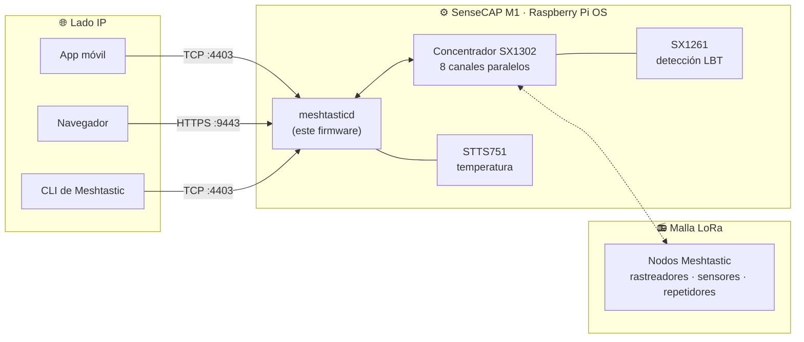

# Pasarela Meshtastic SenseCAP M1

<p align="center">
  
</p>

<p align="center">
  <a href="https://github.com/Seeed-Studio/meshtastic-sx1302/releases">
    
  </a>
  <a href="https://github.com/Seeed-Studio/meshtastic-sx1302/blob/master/LICENSE">
    
  </a>
  <a href="https://github.com/Seeed-Studio/meshtastic-sx1302/commits">
    
  </a>
  
  
</p>

<!-- LANG_SWITCHER_START -->
<p align="center">
  <a href="README.md">English</a> | <a href="README.zh-CN.md">中文</a> | <a href="README.ja.md">日本語</a> | <a href="README.fr.md">Français</a> | <a href="README.pt.md">Português</a> | <b>Español</b>
</p>
<!-- LANG_SWITCHER_END -->

**meshtastic-sx1302** es un port del firmware [Meshtastic](https://meshtastic.org) para hardware concentrador LoRa SX1302. Su objetivo estrella es el [SenseCAP M1][hw-m1] de Seeed — un conjunto Raspberry Pi CM4 + WM1302 vendido originalmente como minero de Helium — al que convierte en una pasarela Meshtastic completa, siempre activa, con soporte de LBT (Listen-Before-Talk) vía SX1261.



[Documentación de Meshtastic][docs] · [Inicio rápido](#inicio-rápido) · [Hardware](#requisitos-de-hardware) · [Reportar un bug][issues]

## Índice

- [Por qué darle una segunda vida a tu M1](#por-qué-darle-una-segunda-vida-a-tu-m1)
- [Características](#características)
- [Inicio rápido](#inicio-rápido)
- [Casos de uso](#casos-de-uso)
- [Hardware recomendado](#hardware-recomendado)
- [Requisitos de hardware](#requisitos-de-hardware)
- [Comprobación de hardware](#comprobación-de-hardware)
- [Instalación](#instalación)
- [Uso](#uso)
- [Ventilador](#ventilador)
- [Región LoRa y cumplimiento](#región-lora-y-cumplimiento)
- [Solución de problemas](#solución-de-problemas)
- [Problemas conocidos](#problemas-conocidos)
- [Preguntas frecuentes](#preguntas-frecuentes)
- [Contribuir](#contribuir)

## Por qué darle una segunda vida a tu M1

El auge de Helium en 2021 puso un pequeño ordenador muy bien construido en miles de hogares. Cuando la economía del minado se desvaneció, el hardware no envejeció:

| Dentro de cada SenseCAP M1 | |
| --- | --- |
| Cómputo | Raspberry Pi CM4 (clase Pi 4, 4 GB) |
| Radio | Módulo WM1302 — concentrador Semtech SX1302 (8 canales) + SX1261 |
| Sensores | Sensor de temperatura STTS751 |
| Térmico | Caja metálica, antena de alta ganancia, ventilador controlado por temperatura (GPIO 13) |

Este repositorio sustituye la pila de minado por [Meshtastic](https://meshtastic.org) — la red mesh LoRa de código abierto fuera de la red eléctrica — y extiende el firmware upstream con soporte del concentrador SX1302 y LBT vía SX1261. Tras un simple reflash, la caja que minaba una moneda ahora reenvía mensajes para una mesh comunitaria, 24/7.

> [!IMPORTANT]
> El módulo WM1302 debe ser la variante **con SX126x** (con capacidad LBT). Los módulos sin LBT no pueden ejercer la capacidad central de este firmware. Confírmalo con la [comprobación de hardware](#comprobación-de-hardware) antes de instalar.

## Características

- **Radio de clase concentrador** — maneja los 8 canales de demodulación paralelos del SX1302, escuchando a varios nodos a la vez en lugar de un único canal como las radios de mano
- **Soporte LBT (requiere SX126x)** — detección de canal Listen-Before-Talk vía SX1261, para una transmisión conforme en las regiones que exigen LBT — la incorporación central de este port
- **Servicios de pasarela permanentes** — Web UI HTTPS integrada (`:9443`) y API TCP (`:4403`) para navegadores, apps móviles y CLI
- **Instalación en un script** — `install.sh` despliega el binario, las configuraciones, el servicio systemd y las bibliotecas, y activa el arranque automático
- **Autodiagnóstico de hardware** — el script de sonda incluido verifica SX1261 / SX1302 / STTS751 en segundos

## Inicio rápido

**Requisitos previos:** un [SenseCAP M1][hw-m1] (o una Raspberry Pi con un módulo WM1302 que incluya SX126x), una microSD de 16 GB o más y un ordenador con lector de tarjetas.

```bash
# 1. Graba Raspberry Pi OS Lite de 64 bits (Debian 13 trixie) con SSH + WiFi
#    preconfigurados — usa los ajustes de personalización de Raspberry Pi Imager
#    https://www.raspberrypi.com/documentation/computers/getting-started.html

# 2. Activa SPI/I2C, instala las dependencias de la sonda y verifica la radio
sudo raspi-config nonint do_spi 0 && sudo raspi-config nonint do_i2c 0
sudo apt install python3 python3-spidev python3-smbus
python3 tools/probe_sx130x.py --reset        # espera 3x PASS

# 3. Instala y arranca
tar xzf meshtasticd-sensecap-m1-aarch64*.tar.gz
cd meshtasticd-sensecap-m1-aarch64*/
sudo ./install.sh
```

Tres pasos. Tu minero ya es una pasarela mesh — abre `https://<ip-de-la-pi>:9443` en el navegador para acceder a la Web UI.

## Casos de uso

- **Columna vertebral de una mesh comunitaria** — un nodo fijo, siempre activo y con antena digna extiende una red Meshtastic a escala urbana mucho más allá del alcance de los dispositivos portátiles
- **Preparación ante emergencias** — un centro de mensajería fuera de la red que sigue funcionando cuando la telefonía móvil e Internet caen
- **Monitorización remota** — recopila posición y telemetría de rastreadores y sensores en una granja, campus u obra
- **Aventuras fuera de cobertura** — coordina grupos de senderismo, overlanding o vela más allá de la cobertura móvil
- **Desarrollo de Meshtastic** — una máquina Linux completa con radio concentradora es el banco de pruebas ideal para el protocolo y las apps

## Hardware recomendado

**La pasarela** — si ya tienes un SenseCAP M1 (cualquier unidad de la era Helium), tienes todo lo necesario: graba este firmware y se convierte en la pasarela. ¿Sin M1? El [módulo WM1302 (SPI)][hw-wm1302] lleva el mismo silicio SX1302 + SX1261 y se conecta a una Raspberry Pi por SPI — consulta la [wiki de WM1302][wiki-wm1302] para el cableado y valida con el mismo script de sonda.

**Nodos de mesh para combinar** — una pasarela necesita nodos con los que hablar. Estos dispositivos Seeed ejecutan el firmware Meshtastic original de fábrica:

| Dispositivo | Tipo | Ideal para | Enlace |
| --- | --- | --- | --- |
| SenseCAP Card Tracker T1000-E | Rastreador de bolsillo | GPS fuera de cobertura, uso cotidiano | [Comprar][hw-sensecap] |
| Wio Tracker L1 Pro | Nodo portátil | Nodo de campo con pantalla, ideal para exteriores | [Comprar][hw-wio] |
| XIAO ESP32S3 + Wio-SX1262 | Kit DIY | Construir tus propios nodos y sensores al menor costo | [Comprar][hw-xiao] |

> [!TIP]
> **Una pasarela, varios nodos** — el T1000-E acompaña a personas y vehículos, el Wio L1 Pro sirve como estación fija con pantalla, y el kit XIAO reduce al mínimo el coste de los nodos DIY. Todos se comunican con tu M1 reflasheado por la misma mesh.

## Requisitos de hardware

| Requisito | Detalles |
| --- | --- |
| Sistema operativo | Raspberry Pi OS Lite de 64 bits, **Debian 13 trixie** — [guía de instalación][pi-getting-started] |
| Red | WiFi o Ethernet, configurada y accesible desde tu LAN |
| SPI / I2C | Activados — [guía de configuración][pi-config] |
| Módulo de radio | WM1302 **con SX126x** (variante con LBT) |

> [!IMPORTANT]
> La variante del WM1302 importa: solo los módulos que incluyen SX126x ofrecen la detección Listen-Before-Talk de la que depende este firmware. Ejecuta la [comprobación de hardware](#comprobación-de-hardware) siguiente para confirmarlo antes de instalar.

## Comprobación de hardware

```bash
# Dependencias
sudo apt update
sudo apt install python3 python3-spidev python3-smbus gpiod i2c-tools wget git

# Concede a tu usuario acceso a los dispositivos SPI/I2C/GPIO
sudo usermod -aG spi,i2c,gpio $USER

# Cierra sesión y vuelve a entrar (o reinicia), después:
python3 tools/probe_sx130x.py --reset
```

Las tres pruebas deben mostrar `PASS`:

```text
SX1261 @ /dev/spidev0.1: PASS
  pram version: SX1261 V2D 2D02
  ...
SX1302 @ /dev/spidev0.0: PASS
  version: 0x10, version string: v1.0
  ...
STTS751 @ /dev/i2c-1 address 0x39: PASS
  product: STTS751-0, temperature: 34.75 °C
  ...
Result: PASS (SX1302 + SX1261 + STTS751 all responded)
```

*`pram version` no es una errata — designa el registro de versión PRAM (RAM de programa) del SX1261, leído por SPI por el script de sonda.*

## Instalación

### Opción A — Versión precompilada (recomendada)

Descarga el paquete más reciente de [Releases][releases] e instala en el dispositivo:

```bash
wget https://github.com/Seeed-Studio/meshtastic-sx1302/releases/latest/download/meshtasticd-sensecap-m1-aarch64.tar.gz
tar xzf meshtasticd-sensecap-m1-aarch64*.tar.gz
cd meshtasticd-sensecap-m1-aarch64*/
sudo ./install.sh
```

Notas:

- El nombre del directorio del paquete lleva un sufijo de hash de git (p. ej. `-e3a6d9dcf`) — por eso el `cd` anterior usa un comodín.
- `install.sh` copia el binario a `/usr/bin`, instala las configuraciones en `/etc/meshtasticd/`, registra el servicio systemd `meshtasticd`, instala las bibliotecas y activa el arranque automático.
- Este repositorio es actualmente **privado** — la descarga de releases requiere una cuenta GitHub con sesión iniciada y autorizada. Si `wget` devuelve 404, abre la página de [Releases][releases] en el navegador y descarga manualmente el `.tar.gz` más reciente.

### Opción B — Compilar desde el código con Docker

```bash
# Emulación QEMU Aarch64 (solo hosts x86)
sudo docker run --privileged --rm tonistiigi/binfmt --install arm64

# Compilación
sudo docker buildx build --platform linux/arm64 -f Dockerfile.sensecap-m1 -t meshtastic-sensecap-m1:arm64 .

# Empaquetado
sudo docker run --rm -v "$PWD/release:/out" meshtastic-sensecap-m1:arm64 \
  sh -c 'cp /opt/firmware/.pio/build/sensecap-m1/meshtasticd /out/meshtasticd_linux_aarch64'
WEB_VERSION=2.7.2 bash bin/package-sensecap-m1.sh
```

El paquete `meshtasticd-sensecap-m1-aarch64.tar.gz` quedará en el directorio `release/` del código fuente. `WEB_VERSION` define qué versión de la Web UI de Meshtastic se incluye en el paquete — mantenla sincronizada con el firmware que estés compilando. Cópialo a la Pi, extráelo y ejecuta `install.sh` como en la Opción A.

## Uso

### Web UI

Abre `https://<ip-de-la-pi>:9443` para usar la Web UI de Meshtastic. En el primer arranque, añade una conexión dentro de la página con la misma dirección. El certificado HTTPS es autofirmado — acepta el aviso del navegador una vez.

<p align="center">
  
</p>

> [!NOTE]
> Bug conocido del upstream: el estado ACK de los mensajes puede no mostrarse correctamente en la Web UI. Pendiente de corrección en Meshtastic upstream.

### App móvil / CLI

Cualquier cliente Meshtastic funciona — app Android/iOS, CLI o SDK de Python. Elige una conexión **TCP**, introduce la IP de la Pi y el puerto predeterminado **4403**:

```bash
pip install meshtastic
meshtastic --host <ip-de-la-pi> --info
```

### Gestión del servicio

| Acción | Comando |
| --- | --- |
| Estado | `systemctl status meshtasticd` |
| Iniciar / parar / reiniciar | `sudo systemctl start meshtasticd` — sustituye `start` por `stop` o `restart` |
| Arranque automático | activado por defecto — verifica con `systemctl is-enabled meshtasticd` |
| Registros en vivo | `journalctl -u meshtasticd -f` |

## Ventilador

El SenseCAP M1 incluye un ventilador controlado por temperatura conectado al **GPIO 13**. Actívalo con el overlay oficial `gpio-fan` — añade a `/boot/firmware/config.txt` y reinicia:

```bash
dtoverlay=gpio-fan,gpiopin=13,temp=55000,hyst=5000
```

El ventilador arranca a 55 °C y se detiene a 50 °C. Consulta la [documentación case-fan de Raspberry Pi][pi-case-fan] para más detalles.

## Región LoRa y cumplimiento

El firmware viene con la región **US915** (902–928 MHz). Cámbiala para ajustarte a tus regulaciones locales y al resto de nodos de la mesh — mediante los ajustes de radio de la Web UI, o la sección `[Lora]` de `/etc/meshtasticd/config.yaml`, y reinicia el servicio.

| Región | Banda de frecuencia |
| --- | --- |
| `US915` (predeterminada) | 902–928 MHz |
| `EU_868` | 863–870 MHz |
| `CN_470` | 470–510 MHz |
| `JP923` | 920–928 MHz |

> [!IMPORTANT]
> Todos los nodos de una mesh deben compartir la misma región y el mismo preset de módem. Transmitir fuera de las regulaciones de tu región puede ser ilegal — el LBT vía SX126x de este firmware existe precisamente para ayudar a cumplir tales reglas.

## Solución de problemas

| Síntoma | Comprobación |
| --- | --- |
| El LED ACT verde nunca parpadea al arrancar | Tarjeta SD mal insertada — apaga y reinserta hasta que haga clic |
| La Pi está en línea pero inaccesible desde tu PC | El WiFi de oficina/público suele aislar clientes por punto de acceso — reconecta al mismo AP, o localiza la Pi con `arp -a` |
| SSH `Permission denied (publickey,password)` | Esperado tras un reflash — entra una vez con la contraseña y reinstala tu clave |
| El servicio falla: `cannot open shared object file` | Falta una biblioteca — `ldd /usr/bin/meshtasticd` e instala los paquetes `not found` |
| `$'\r': command not found` en un script | Finales de línea CRLF de Windows — `sed -i 's/\r$//' ARCHIVO` |
| `./install.sh: Permission denied` | Bit de ejecución perdido en tránsito — `chmod +x install.sh` |
| `systemctl` no encuentra la unidad `meshtastcd` | Errata (vista en documentación antigua) — el servicio es `meshtasticd` |
| Cualquier prueba de sonda da `FAIL` | ¿SPI/I2C activados? ¿Módulo bien insertado? ¿Volviste a iniciar sesión tras `usermod`? |

¿Encontraste un bug? [Abre un issue][issues] con el estado del servicio, la salida de `journalctl -u meshtasticd` y los resultados de la sonda.

## Problemas conocidos

- Web UI: el estado ACK de los mensajes puede no mostrarse — seguimiento en el upstream de Meshtastic
- Los nombres de directorio de los paquetes incluyen un sufijo de hash de git
- La región del firmware es US915 por defecto — cámbiala antes del uso en producción en otras regiones

## Preguntas frecuentes

**¿Qué variantes del WM1302 son compatibles?**
Solo los módulos que incluyen **SX126x** (con LBT). Ejecuta la [comprobación de hardware](#comprobación-de-hardware) para confirmarlo.

**¿Necesito un SenseCAP M1?**
El M1 es el camino directo y el objetivo del paquete de instalación. Los usuarios avanzados pueden adaptar la compilación a otros hosts SX1302 — el script de sonda es un buen punto de partida.

**La descarga de la release devuelve 404.**
El repositorio es actualmente privado — descarga con sesión iniciada en una cuenta GitHub autorizada y consulta la página de [Releases][releases] para el nombre exacto del recurso.

**¿Puedo seguir minando Helium con esto?**
No — este firmware sustituye por completo la pila de minado. Considéralo un billete de ida hacia una red más útil.

## Contribuir

¡Damos la bienvenida a contribuciones de todo tipo!

- **Informes de bugs y peticiones de funciones** — [abre un issue][issues]
- **Contribuciones de código** — haz fork, crea una rama y envía un PR; mantén la coherencia con el estilo del upstream de Meshtastic cuando sea posible
- **Documentación y traducciones** — las mejoras y los nuevos idiomas siempre son bienvenidos

---

Si este proyecto le dio una segunda vida a tu minero, déjanos una estrella ⭐ — ¡ayuda a otros a descubrirlo!

<!-- Enlaces de referencia -->
[docs]: https://meshtastic.org/docs/
[issues]: https://github.com/Seeed-Studio/meshtastic-sx1302/issues
[releases]: https://github.com/Seeed-Studio/meshtastic-sx1302/releases
[hw-m1]: https://www.seeedstudio.com/SenseCAP-M1-LoRaWAN-Indoor-Gateway-AS923-p-5059.html
[hw-wm1302]: https://www.seeedstudio.com/WM1302-LoRaWAN-Gateway-Module-SPI-US915-p-4890.html
[hw-sensecap]: https://www.seeedstudio.com/SenseCAP-Card-Tracker-T1000-E-for-Meshtastic-p-5913.html
[hw-wio]: https://www.seeedstudio.com/Wio-Tracker-L1-Pro-p-6454.html
[hw-xiao]: https://www.seeedstudio.com/Wio-SX1262-with-XIAO-ESP32S3-p-5982.html
[wiki-wm1302]: https://wiki.seeedstudio.com/WM1302_module/
[pi-getting-started]: https://www.raspberrypi.com/documentation/computers/getting-started.html
[pi-config]: https://www.raspberrypi.com/documentation/computers/configuration.html
[pi-case-fan]: https://www.raspberrypi.com/documentation/computers/configuration.html?#case-fan
