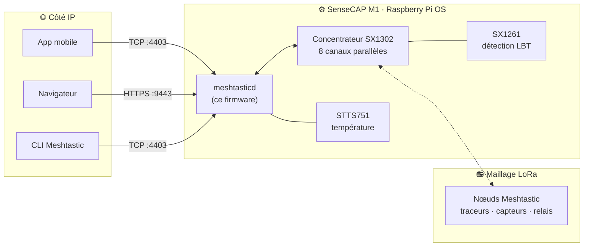

# Passerelle Meshtastic SenseCAP M1

<p align="center">
  
</p>

<p align="center">
  <a href="https://github.com/Seeed-Studio/meshtastic-sx1302/releases">
    
  </a>
  <a href="https://github.com/Seeed-Studio/meshtastic-sx1302/blob/master/LICENSE">
    
  </a>
  <a href="https://github.com/Seeed-Studio/meshtastic-sx1302/commits">
    
  </a>
  
  
</p>

<!-- LANG_SWITCHER_START -->
<p align="center">
  <a href="README.md">English</a> | <a href="README.zh-CN.md">中文</a> | <a href="README.ja.md">日本語</a> | <b>Français</b> | <a href="README.pt.md">Português</a> | <a href="README.es.md">Español</a>
</p>
<!-- LANG_SWITCHER_END -->

**meshtastic-sx1302** est un portage du firmware [Meshtastic](https://meshtastic.org) pour les concentrateurs LoRa SX1302. Sa cible phare est le [SenseCAP M1][hw-m1] de Seeed — un ensemble Raspberry Pi CM4 + WM1302 livré à l'origine comme mineur Helium — qu'il transforme en passerelle Meshtastic complète, toujours allumée, avec prise en charge du LBT (Listen-Before-Talk) via SX1261.



[Documentation Meshtastic][docs] · [Démarrage rapide](#démarrage-rapide) · [Matériel](#configuration-requise) · [Signaler un bug][issues]

## Sommaire

- [Pourquoi redonner vie à votre M1](#pourquoi-redonner-vie-à-votre-m1)
- [Fonctionnalités](#fonctionnalités)
- [Démarrage rapide](#démarrage-rapide)
- [Cas d'utilisation](#cas-dutilisation)
- [Matériel recommandé](#matériel-recommandé)
- [Configuration requise](#configuration-requise)
- [Vérification du matériel](#vérification-du-matériel)
- [Installation](#installation)
- [Utilisation](#utilisation)
- [Ventilateur](#ventilateur)
- [Région LoRa et conformité](#région-lora-et-conformité)
- [Dépannage](#dépannage)
- [Problèmes connus](#problèmes-connus)
- [FAQ](#faq)
- [Contribuer](#contribuer)

## Pourquoi redonner vie à votre M1

Le boom Helium de 2021 a mis un petit ordinateur remarquablement bien construit dans des milliers de foyers. Quand l'économie du minage s'est effondrée, le matériel, lui, n'a pas vieilli :

| À l'intérieur de chaque SenseCAP M1 | |
| --- | --- |
| Calcul | Raspberry Pi CM4 (classe Pi 4, 4 Go) |
| Radio | Module WM1302 — concentrateur Semtech SX1302 (8 canaux) + SX1261 |
| Capteurs | Capteur de température STTS751 |
| Thermique | Boîtier métal, antenne à fort gain, ventilateur piloté en température (GPIO 13) |

Ce dépôt remplace la pile de minage par [Meshtastic](https://meshtastic.org) — le réseau maillé LoRa open source hors grille — et étend le firmware amont avec la prise en charge du concentrateur SX1302 et le LBT via SX1261. Après un simple reflash, la boîte qui minait une cryptomonnaie relaie désormais des messages pour un maillage communautaire, 24 h/24.

> [!IMPORTANT]
> Le module WM1302 doit être la variante **avec SX126x** (compatible LBT). Les modules sans LBT ne peuvent pas exploiter la capacité centrale de ce firmware. Confirmez avec la [vérification du matériel](#vérification-du-matériel) avant d'installer.

## Fonctionnalités

- **Radio de classe concentrateur** — exploite les 8 canaux de démodulation parallèles du SX1302, pour entendre plusieurs nœuds à la fois au lieu d'un seul canal comme les radios portatives
- **Prise en charge LBT (SX126x requis)** — détection de canal Listen-Before-Talk via le SX1261, pour une émission conforme dans les régions qui imposent le LBT — l'ajout central de ce portage
- **Services de passerelle permanents** — Web UI HTTPS intégrée (`:9443`) et API TCP (`:4403`) pour navigateurs, applications mobiles et CLI
- **Installation en un script** — `install.sh` déploie le binaire, les configs, le service systemd et les bibliothèques, et active le démarrage automatique
- **Autodiagnostic matériel** — le script de sonde fourni vérifie SX1261 / SX1302 / STTS751 en quelques secondes

## Démarrage rapide

**Prérequis :** un [SenseCAP M1][hw-m1] (ou un Raspberry Pi avec un module WM1302 incluant un SX126x), une carte microSD de 16 Go ou plus, et un ordinateur avec lecteur de carte.

```bash
# 1. Flashez Raspberry Pi OS Lite 64 bits (Debian 13 trixie) avec SSH + WiFi
#    préconfigurés — via les réglages de personnalisation de Raspberry Pi Imager
#    https://www.raspberrypi.com/documentation/computers/getting-started.html

# 2. Activez SPI/I2C, installez les dépendances de la sonde, puis vérifiez la radio
sudo raspi-config nonint do_spi 0 && sudo raspi-config nonint do_i2c 0
sudo apt install python3 python3-spidev python3-smbus
python3 tools/probe_sx130x.py --reset        # attendez 3x PASS

# 3. Installez et démarrez
tar xzf meshtasticd-sensecap-m1-aarch64*.tar.gz
cd meshtasticd-sensecap-m1-aarch64*/
sudo ./install.sh
```

Trois étapes. Votre mineur est devenu une passerelle maillée — ouvrez `https://<ip-du-pi>:9443` dans un navigateur pour accéder à la Web UI.

## Cas d'utilisation

- **Colonne vertébrale de maillage communautaire** — un nœud fixe, toujours allumé, avec une vraie antenne étend un réseau Meshtastic à l'échelle d'une ville bien au-delà de la portée des appareils portables
- **Préparation aux urgences** — un concentrateur de messagerie hors grille qui continue de fonctionner quand le cellulaire et Internet tombent
- **Surveillance à distance** — collectez positions et télémétrie de traceurs et capteurs sur une ferme, un campus ou un chantier
- **Aventures hors réseau** — coordonnez des groupes de randonnée, de raid ou de voile au-delà de la couverture cellulaire
- **Développement Meshtastic** — une vraie machine Linux dotée d'une radio concentrateur est le banc d'essai idéal pour le protocole et les applications

## Matériel recommandé

**La passerelle** — si vous possédez déjà un SenseCAP M1 (n'importe quelle unité de l'ère Helium), vous avez tout ce qu'il faut : flashez ce firmware et il devient la passerelle. Pas de M1 ? Le [module WM1302 (SPI)][hw-wm1302] embarque la même puce SX1302 + SX1261 et se connecte à un Raspberry Pi via SPI — consultez le [wiki WM1302][wiki-wm1302] pour le câblage, puis validez avec le même script de sonde.

**Nœuds de maillage à associer** — une passerelle a besoin de nœuds auxquels parler. Ces appareils Seeed exécutent le firmware Meshtastic d'origine dès la sortie de la boîte :

| Dispositif | Type | Idéal pour | Lien |
| --- | --- | --- | --- |
| SenseCAP Card Tracker T1000-E | Traceur de poche | GPS hors grille, porté au quotidien | [Acheter][hw-sensecap] |
| Wio Tracker L1 Pro | Nœud portable | Nœud de terrain avec écran, parfait en extérieur | [Acheter][hw-wio] |
| XIAO ESP32S3 + Wio-SX1262 | Kit DIY | Fabriquer vos nœuds et capteurs au moindre coût | [Acheter][hw-xiao] |

> [!TIP]
> **Une passerelle, plusieurs nœuds** — le T1000-E accompagne personnes et véhicules, le Wio L1 Pro sert de station fixe avec écran, et le kit XIAO réduit au minimum le coût des nœuds DIY. Tous communiquent avec votre M1 reflashé via le même maillage.

## Configuration requise

| Exigence | Détails |
| --- | --- |
| Système | Raspberry Pi OS Lite 64 bits, **Debian 13 trixie** — [guide d'installation][pi-getting-started] |
| Réseau | WiFi ou Ethernet, configuré et joignable depuis votre LAN |
| SPI / I2C | Activés — [guide de configuration][pi-config] |
| Module radio | WM1302 **avec SX126x** (variante compatible LBT) |

> [!IMPORTANT]
> La variante du WM1302 compte : seuls les modules incluant un SX126x fournissent la détection Listen-Before-Talk sur laquelle ce firmware s'appuie. Lancez la [vérification du matériel](#vérification-du-matériel) ci-dessous pour confirmer avant l'installation.

## Vérification du matériel

```bash
# Dépendances
sudo apt update
sudo apt install python3 python3-spidev python3-smbus gpiod i2c-tools wget git

# Donnez à votre utilisateur l'accès aux périphériques SPI/I2C/GPIO
sudo usermod -aG spi,i2c,gpio $USER

# Déconnectez-vous puis reconnectez-vous (ou redémarrez), ensuite :
python3 tools/probe_sx130x.py --reset
```

Les trois tests doivent afficher `PASS` :

```text
SX1261 @ /dev/spidev0.1: PASS
  pram version: SX1261 V2D 2D02
  ...
SX1302 @ /dev/spidev0.0: PASS
  version: 0x10, version string: v1.0
  ...
STTS751 @ /dev/i2c-1 address 0x39: PASS
  product: STTS751-0, temperature: 34.75 °C
  ...
Result: PASS (SX1302 + SX1261 + STTS751 all responded)
```

*`pram version` n'est pas une coquille — il désigne le registre de version PRAM (RAM programme) du SX1261, lu via SPI par le script de sonde.*

## Installation

### Option A — Version précompilée (recommandée)

Téléchargez le dernier paquet depuis [Releases][releases] et installez-le sur l'appareil :

```bash
wget https://github.com/Seeed-Studio/meshtastic-sx1302/releases/latest/download/meshtasticd-sensecap-m1-aarch64.tar.gz
tar xzf meshtasticd-sensecap-m1-aarch64*.tar.gz
cd meshtasticd-sensecap-m1-aarch64*/
sudo ./install.sh
```

Remarques :

- Le nom du répertoire du paquet comporte un suffixe de hach git (ex. `-e3a6d9dcf`) — d'où le joker dans le `cd` ci-dessus.
- `install.sh` copie le binaire vers `/usr/bin`, installe les configs dans `/etc/meshtasticd/`, enregistre le service systemd `meshtasticd`, installe les bibliothèques et active le démarrage automatique.
- Ce dépôt est actuellement **privé** — le téléchargement des releases requiert un compte GitHub connecté et autorisé. Si `wget` renvoie 404, ouvrez la page [Releases][releases] dans un navigateur et récupérez manuellement le dernier `.tar.gz`.

### Option B — Compiler depuis les sources avec Docker

```bash
# Émulation QEMU Aarch64 (hôtes x86 uniquement)
sudo docker run --privileged --rm tonistiigi/binfmt --install arm64

# Compilation
sudo docker buildx build --platform linux/arm64 -f Dockerfile.sensecap-m1 -t meshtastic-sensecap-m1:arm64 .

# Empaquetage
sudo docker run --rm -v "$PWD/release:/out" meshtastic-sensecap-m1:arm64 \
  sh -c 'cp /opt/firmware/.pio/build/sensecap-m1/meshtasticd /out/meshtasticd_linux_aarch64'
WEB_VERSION=2.7.2 bash bin/package-sensecap-m1.sh
```

Le paquet `meshtasticd-sensecap-m1-aarch64.tar.gz` est déposé dans le répertoire `release/` des sources. `WEB_VERSION` choisit la version de la Web UI Meshtastic intégrée au paquet — gardez-la synchronisée avec le firmware que vous compilez. Copiez le paquet sur le Pi, extrayez-le et lancez `install.sh` comme en Option A.

## Utilisation

### Web UI

Ouvrez `https://<ip-du-pi>:9443` pour la Web UI Meshtastic. Au premier lancement, ajoutez une connexion dans la page avec la même adresse. Le certificat HTTPS est auto-signé — acceptez l'avertissement du navigateur une fois.

<p align="center">
  
</p>

> [!NOTE]
> Bug amont connu : le statut ACK des messages peut ne pas s'afficher correctement dans la Web UI. En attente d'un correctif côté Meshtastic.

### App mobile / CLI

Tous les clients Meshtastic fonctionnent — app Android/iOS, CLI ou SDK Python. Choisissez une connexion **TCP**, entrez l'IP du Pi et le port par défaut **4403** :

```bash
pip install meshtastic
meshtastic --host <ip-du-pi> --info
```

### Gestion du service

| Action | Commande |
| --- | --- |
| État | `systemctl status meshtasticd` |
| Démarrer / arrêter / redémarrer | `sudo systemctl start meshtasticd` — remplacez `start` par `stop` ou `restart` |
| Démarrage automatique | activé par défaut — vérifiez avec `systemctl is-enabled meshtasticd` |
| Journaux en direct | `journalctl -u meshtasticd -f` |

## Ventilateur

Le SenseCAP M1 est livré avec un ventilateur piloté en température câblé sur le **GPIO 13**. Activez-le avec l'overlay officiel `gpio-fan` — ajoutez à `/boot/firmware/config.txt` et redémarrez :

```bash
dtoverlay=gpio-fan,gpiopin=13,temp=55000,hyst=5000
```

Le ventilateur démarre à 55 °C et s'arrête à 50 °C. Voir la [documentation Raspberry Pi case-fan][pi-case-fan] pour les détails.

## Région LoRa et conformité

Le firmware est livré avec la région **US915** (902–928 MHz). Changez-la pour respecter vos réglementations locales et les autres nœuds du maillage — via les réglages radio de la Web UI, ou la section `[Lora]` de `/etc/meshtasticd/config.yaml`, puis redémarrez le service.

| Région | Bande de fréquences |
| --- | --- |
| `US915` (défaut) | 902–928 MHz |
| `EU_868` | 863–870 MHz |
| `CN_470` | 470–510 MHz |
| `JP923` | 920–928 MHz |

> [!IMPORTANT]
> Tous les nœuds d'un maillage doivent partager la même région et le même preset de modem. Émettre hors des réglementations de votre région peut être illégal — le LBT via SX126x de ce firmware existe précisément pour aider à respecter de telles règles.

## Dépannage

| Symptôme | Vérification |
| --- | --- |
| La LED ACT verte ne clignote jamais au démarrage | Carte SD mal insérée — éteignez et réinsérez jusqu'au clic |
| Le Pi est en ligne mais injoignable depuis votre PC | Les WiFi de bureau/public isolent souvent les clients par point d'accès — reconnectez-vous au même AP, ou trouvez le Pi avec `arp -a` |
| SSH `Permission denied (publickey,password)` | Attendu après un reflash — connectez-vous une fois avec le mot de passe, puis réinstallez votre clé |
| Le service échoue : `cannot open shared object file` | Bibliothèque manquante — `ldd /usr/bin/meshtasticd` et installez les paquets `not found` |
| `$'\r': command not found` dans un script | Fins de ligne CRLF Windows — `sed -i 's/\r$//' FICHIER` |
| `./install.sh: Permission denied` | Bit d'exécution perdu en transit — `chmod +x install.sh` |
| `systemctl` ne trouve pas l'unité `meshtastcd` | Coquille (vue dans d'anciens docs) — le service s'appelle `meshtasticd` |
| Un test de sonde échoue (`FAIL`) | SPI/I2C activés ? Module bien inséré ? Reconnecté après `usermod` ? |

Un bug ? [Ouvrez un ticket][issues] avec l'état du service, la sortie de `journalctl -u meshtasticd` et les résultats de la sonde.

## Problèmes connus

- Web UI : le statut ACK des messages peut ne pas s'afficher — suivi en amont chez Meshtastic
- Les noms de répertoires des paquets incluent un suffixe de hach git
- La région du firmware est US915 par défaut — modifiez-la avant tout usage en production dans d'autres régions

## FAQ

**Quelles variantes du WM1302 sont prises en charge ?**
Uniquement les modules incluant un **SX126x** (compatibles LBT). Lancez la [vérification du matériel](#vérification-du-matériel) pour confirmer.

**Ai-je besoin d'un SenseCAP M1 ?**
Le M1 est le chemin clé en main et la cible du paquet d'installation. Les utilisateurs avancés peuvent adapter la compilation à d'autres hôtes SX1302 — le script de sonde est un bon point de départ.

**Le téléchargement de la release renvoie 404.**
Le dépôt est actuellement privé — téléchargez en étant connecté à un compte GitHub autorisé, et consultez la page [Releases][releases] pour le nom exact de l'asset.

**Puis-je continuer à miner Helium avec ça ?**
Non — ce firmware remplace entièrement la pile de minage. Considérez-le comme un billet aller simple vers un réseau plus utile.

## Contribuer

Nous accueillons les contributions de toutes sortes !

- **Rapports de bugs et demandes de fonctionnalités** — [ouvrez un ticket][issues]
- **Contributions de code** — forkez, créez une branche et soumettez un PR ; restez autant que possible aligné sur le style de Meshtastic amont
- **Documentation et traductions** — améliorations et nouvelles langues toujours appréciées

---

Si ce projet a offert une seconde vie à votre mineur, laissez-nous une étoile ⭐ — cela aide les autres à le découvrir !

<!-- Liens de référence -->
[docs]: https://meshtastic.org/docs/
[issues]: https://github.com/Seeed-Studio/meshtastic-sx1302/issues
[releases]: https://github.com/Seeed-Studio/meshtastic-sx1302/releases
[hw-m1]: https://www.seeedstudio.com/SenseCAP-M1-LoRaWAN-Indoor-Gateway-AS923-p-5059.html
[hw-wm1302]: https://www.seeedstudio.com/WM1302-LoRaWAN-Gateway-Module-SPI-US915-p-4890.html
[hw-sensecap]: https://www.seeedstudio.com/SenseCAP-Card-Tracker-T1000-E-for-Meshtastic-p-5913.html
[hw-wio]: https://www.seeedstudio.com/Wio-Tracker-L1-Pro-p-6454.html
[hw-xiao]: https://www.seeedstudio.com/Wio-SX1262-with-XIAO-ESP32S3-p-5982.html
[wiki-wm1302]: https://wiki.seeedstudio.com/WM1302_module/
[pi-getting-started]: https://www.raspberrypi.com/documentation/computers/getting-started.html
[pi-config]: https://www.raspberrypi.com/documentation/computers/configuration.html
[pi-case-fan]: https://www.raspberrypi.com/documentation/computers/configuration.html?#case-fan
