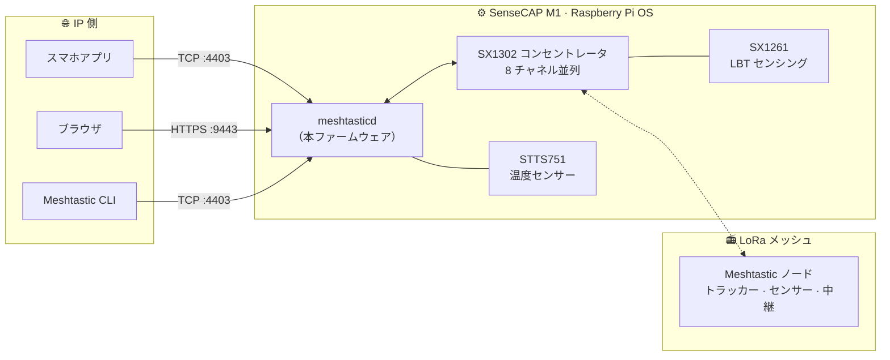

# SenseCAP M1 Meshtastic ゲートウェイ

<p align="center">
  
</p>

<p align="center">
  <a href="https://github.com/Seeed-Studio/meshtastic-sx1302/releases">
    
  </a>
  <a href="https://github.com/Seeed-Studio/meshtastic-sx1302/blob/master/LICENSE">
    
  </a>
  <a href="https://github.com/Seeed-Studio/meshtastic-sx1302/commits">
    
  </a>
  
  
</p>

<!-- LANG_SWITCHER_START -->
<p align="center">
  <a href="README.md">English</a> | <a href="README.zh-CN.md">中文</a> | <b>日本語</b> | <a href="README.fr.md">Français</a> | <a href="README.pt.md">Português</a> | <a href="README.es.md">Español</a>
</p>
<!-- LANG_SWITCHER_END -->

**meshtastic-sx1302** は、SX1302 LoRa コンセントレータ向けの [Meshtastic](https://meshtastic.org) ファームウェア移植です。主力ターゲットは Seeed [SenseCAP M1][hw-m1] —— Helium マイナーとして出荷された Raspberry Pi CM4 + WM1302 の組み合わせで、本ファームウェアはこれを、SX1261 による LBT（Listen-Before-Talk）対応の常時稼働 Meshtastic メッシュゲートウェイへと生まれ変わらせます。



[Meshtastic ドキュメント][docs] · [クイックスタート](#クイックスタート) · [ハードウェア要件](#ハードウェア要件) · [バグ報告][issues]

## 目次

- [なぜ M1 に第二の人生を](#なぜ-m1-に第二の人生を)
- [主な機能](#主な機能)
- [クイックスタート](#クイックスタート)
- [ユースケース](#ユースケース)
- [推奨ハードウェア](#推奨ハードウェア)
- [ハードウェア要件](#ハードウェア要件)
- [ハードウェアチェック](#ハードウェアチェック)
- [インストール](#インストール)
- [使い方](#使い方)
- [冷却ファン](#冷却ファン)
- [LoRa リージョンと法規制](#lora-リージョンと法規制)
- [トラブルシューティング](#トラブルシューティング)
- [既知の問題](#既知の問題)
- [よくある質問](#よくある質問)
- [コントリビューション](#コントリビューション)

## なぜ M1 に第二の人生を

2021 年の Helium ブームは、良くできた小型コンピュータを何千もの家庭に届けました。マイニングの経済性が薄れた後も、ハードウェアは古びていません：

| SenseCAP M1 の中身 | |
| --- | --- |
| 計算 | Raspberry Pi CM4（Pi 4 相当、4 GB） |
| 無線 | WM1302 モジュール —— Semtech SX1302 コンセントレータ（8 チャネル）+ SX1261 |
| センシング | STTS751 温度センサー |
| 放熱 | 金属筐体、高利得アンテナ、温度制御ファン（GPIO 13） |

本リポジトリはマイニングスタックを [Meshtastic](https://meshtastic.org) —— オープンソースのオフグリッド LoRa メッシュネットワーク —— で置き換え、上流ファームウェアに SX1302 コンセントレータ対応と SX1261 ベースの LBT を追加します。再書き込み一回で、かつてコインを掘っていた箱が、コミュニティメッシュのために 24 時間メッセージを中継し始めます。

> [!IMPORTANT]
> WM1302 モジュールは **SX126x 搭載版**（LBT 対応）である必要があります。非対応モジュールでは本ファームウェアの中核機能を利用できません。インストール前に[ハードウェアチェック](#ハードウェアチェック)で確認してください。

## 主な機能

- **コンセントレータ級の無線性能** —— SX1302 の 8 並列復調チャネルを駆動し、携帯型無線のような単一チャネルではなく、多数のノードを同時にリッスン
- **LBT 対応（SX126x 必須）** —— SX1261 による Listen-Before-Talk のチャネル検知で、LBT が義務付けられる地域での適合送信を実現。本移植の中核追加機能
- **常駐ゲートウェイサービス** —— 内蔵 HTTPS Web UI（`:9443`）と TCP API（`:4403`）でブラウザ・スマホアプリ・CLI に対応
- **ワンコマンドインストール** —— `install.sh` がバイナリ・設定・systemd サービス・ランタイムライブラリを配備し、自動起動を有効化
- **ハードウェア自己診断** —— 同梱のプローブスクリプトで SX1261 / SX1302 / STTS751 を数秒で検証

## クイックスタート

**前提条件：** [SenseCAP M1][hw-m1]（または SX126x 搭載 WM1302 を備えた Raspberry Pi）、16 GB 以上の microSD カード、カードリーダー付き PC。

```bash
# 1. Raspberry Pi Imager で Raspberry Pi OS Lite 64 ビット（Debian 13 trixie）を書き込み、
#    OS カスタマイズ設定で SSH と WiFi を事前設定
#    https://www.raspberrypi.com/documentation/computers/getting-started.html

# 2. SPI/I2C を有効化し、プローブの依存パッケージを導入してから無線ハードウェアを確認
sudo raspi-config nonint do_spi 0 && sudo raspi-config nonint do_i2c 0
sudo apt install python3 python3-spidev python3-smbus
python3 tools/probe_sx130x.py --reset        # 3 つの PASS を期待

# 3. インストールして起動
tar xzf meshtasticd-sensecap-m1-aarch64*.tar.gz
cd meshtasticd-sensecap-m1-aarch64*/
sudo ./install.sh
```

3 ステップで、マイナーがメッシュゲートウェイに変わります。ブラウザで `https://<Pi の IP>:9443` を開けば Web UI にアクセスできます。

## ユースケース

- **コミュニティメッシュのバックボーン** —— 適切なアンテナを備えた固定・常時稼働ノードが、都市規模の Meshtastic ネットワークを携帯端末の届かない範囲まで広げます
- **防災備え** —— 携帯回線もインターネットも使えなくなったときに動き続けるオフグリッド通信ハブ
- **遠隔モニタリング** —— 農場・キャンパス・工事現場のトラッカーやセンサーから位置とテレメトリを収集
- **オフグリッド冒険** —— 電波圏外のハイキング・オーバーランド・セーリンググループの連絡手段
- **Meshtastic 開発** —— コンセントレータ無線を備えたフル Linux マシンは、プロトコル・アプリ開発の理想的なテストベンチ

## 推奨ハードウェア

**ゲートウェイ本体** —— SenseCAP M1（Helium 時代のどの個体でも）をすでにお持ちなら、必要なものはすべて揃っています。このファームウェアを書き込めばゲートウェイになります。M1 がない？[WM1302（SPI）モジュール][hw-wm1302] は同じ SX1302 + SX1261 チップを搭載し、SPI 経由で Raspberry Pi に接続できます —— 配線は [WM1302 Wiki][wiki-wm1302] を参照し、同じプローブスクリプトで検証してください。

**組み合わせるメッシュノード** —— ゲートウェイには対話するノードが必要です。以下の Seeed デバイスは純正 Meshtastic ファームウェアを工場出荷時から実行します：

| デバイス | 種類 | 用途 | リンク |
| --- | --- | --- | --- |
| SenseCAP Card Tracker T1000-E | ポケットトラッカー | オフグリッド GPS 追跡、日常携帯 | [購入][hw-sensecap] |
| Wio Tracker L1 Pro | 携帯ノード | 画面付きの携帯型フィールドノード、屋外に最適 | [購入][hw-wio] |
| XIAO ESP32S3 + Wio-SX1262 | DIY キット | 最低コストで自作ノード・センサーを構築 | [購入][hw-xiao] |

> [!TIP]
> **1 つのゲートウェイに複数のノードを** —— T1000-E は人や車と一緒に移動し、Wio L1 Pro は画面付きの固定局として、XIAO キットは自作ノードのコストを最小限に抑えます。すべて同じメッシュ経由で、書き換えた M1 と通信します。

## ハードウェア要件

| 要件 | 詳細 |
| --- | --- |
| OS | Raspberry Pi OS Lite 64 ビット、**Debian 13 trixie** —— [インストールガイド][pi-getting-started] |
| ネットワーク | WiFi またはイーサネット、LAN から到達可能 |
| SPI / I2C | 有効化 —— [設定ガイド][pi-config] |
| 無線モジュール | **SX126x 搭載の WM1302**（LBT 対応版） |

> [!IMPORTANT]
> WM1302 のバリエーションは重要です。SX126x を含むモジュールのみが、本ファームウェアが依存する Listen-Before-Talk 検知を提供します。インストール前に下の[ハードウェアチェック](#ハードウェアチェック)で確認してください。

## ハードウェアチェック

```bash
# 依存パッケージ
sudo apt update
sudo apt install python3 python3-spidev python3-smbus gpiod i2c-tools wget git

# SPI/I2C/GPIO デバイスへのアクセス権を付与
sudo usermod -aG spi,i2c,gpio $USER

# 一度ログアウトして再ログイン（または再起動）してから：
python3 tools/probe_sx130x.py --reset
```

3 つのテストすべてが `PASS` なら準備完了です：

```text
SX1261 @ /dev/spidev0.1: PASS
  pram version: SX1261 V2D 2D02
  ...
SX1302 @ /dev/spidev0.0: PASS
  version: 0x10, version string: v1.0
  ...
STTS751 @ /dev/i2c-1 address 0x39: PASS
  product: STTS751-0, temperature: 34.75 °C
  ...
Result: PASS (SX1302 + SX1261 + STTS751 all responded)
```

*`pram version` は誤記ではありません —— SX1261 の PRAM（プログラム RAM）バージョンレジスタを示し、プローブが SPI 経由で読み出します。*

## インストール

### 方法 A —— プリコンパイル版（推奨）

[Releases][releases] から最新パッケージをダウンロードし、デバイス上でインストールします：

```bash
wget https://github.com/Seeed-Studio/meshtastic-sx1302/releases/latest/download/meshtasticd-sensecap-m1-aarch64.tar.gz
tar xzf meshtasticd-sensecap-m1-aarch64*.tar.gz
cd meshtasticd-sensecap-m1-aarch64*/
sudo ./install.sh
```

注意：

- パッケージのディレクトリ名には git コミットハッシュの接尾辞（例：`-e3a6d9dcf`）が付くため、上の `cd` はワイルドカードを使っています。
- `install.sh` はバイナリを `/usr/bin` へ、設定を `/etc/meshtasticd/` へ配置し、`meshtasticd` systemd サービスを登録、ランタイムライブラリをインストールし、自動起動を有効化します。
- 本リポジトリは現在**非公開**です —— Release のダウンロードにはアクセス権のある GitHub アカウントでのログインが必要です。`wget` が 404 を返す場合は、ブラウザで [Releases][releases] ページを開き、最新の `.tar.gz` を手動で取得してください。

### 方法 B —— Docker でソースからビルド

```bash
# Aarch64 QEMU エミュレーション（x86 ホストのみ）
sudo docker run --privileged --rm tonistiigi/binfmt --install arm64

# ビルド
sudo docker buildx build --platform linux/arm64 -f Dockerfile.sensecap-m1 -t meshtastic-sensecap-m1:arm64 .

# パッケージ化
sudo docker run --rm -v "$PWD/release:/out" meshtastic-sensecap-m1:arm64 \
  sh -c 'cp /opt/firmware/.pio/build/sensecap-m1/meshtasticd /out/meshtasticd_linux_aarch64'
WEB_VERSION=2.7.2 bash bin/package-sensecap-m1.sh
```

パッケージ化された `meshtasticd-sensecap-m1-aarch64.tar.gz` はソースツリーの `release/` ディレクトリに保存されます。`WEB_VERSION` はパッケージに同梱する Meshtastic Web UI のバージョンを指定します —— ビルドするファームウェアのバージョンに合わせてください。Pi にコピーして展開し、方法 A と同様に `install.sh` を実行してください。

## 使い方

### Web UI

ブラウザで `https://<Pi の IP>:9443` にアクセスすると Meshtastic Web UI が使えます。初回起動時はページ内で接続を追加してください（同じ URL を指定）。HTTPS 証明書は自己署名のため、ブラウザの警告を一度承認してください。

<p align="center">
  
</p>

> [!NOTE]
> 既知の上流バグ：Web UI でメッセージの ACK ステータスが正しく表示されない場合があります。Meshtastic 上流での修正待ちです。

### スマホアプリ / CLI

Android/iOS アプリ、CLI、Python SDK など、あらゆる Meshtastic クライアントが使えます。**TCP** 接続を選択し、Pi の IP とデフォルトポート **4403** を入力します：

```bash
pip install meshtastic
meshtastic --host <Pi の IP> --info
```

### サービス管理

| 操作 | コマンド |
| --- | --- |
| 状態確認 | `systemctl status meshtasticd` |
| 開始 / 停止 / 再起動 | `sudo systemctl start meshtasticd` —— `start` を `stop` / `restart` に置き換えてください |
| 自動起動 | デフォルトで有効 —— `systemctl is-enabled meshtasticd` で確認 |
| ライブログ | `journalctl -u meshtasticd -f` |

## 冷却ファン

SenseCAP M1 には **GPIO 13** に接続された温度制御ファンが付属します。公式の `gpio-fan` オーバーレイで有効にできます —— `/boot/firmware/config.txt` に追記して再起動：

```bash
dtoverlay=gpio-fan,gpiopin=13,temp=55000,hyst=5000
```

ファンは 55 °C で回り始め、50 °C で停止します。詳細は [Raspberry Pi の case-fan ドキュメント][pi-case-fan] を参照してください。

## LoRa リージョンと法規制

ファームウェアの既定リージョンは **US915**（902–928 MHz）です。現地の法規制とメッシュ上の他ノードに合わせて変更してください —— Web UI の無線設定、または `/etc/meshtasticd/config.yaml` の `[Lora]` セクションで編集し、サービスを再起動します。

| リージョン | 周波数帯 |
| --- | --- |
| `US915`（既定） | 902–928 MHz |
| `EU_868` | 863–870 MHz |
| `CN_470` | 470–510 MHz |
| `JP923` | 920–928 MHz |

> [!IMPORTANT]
> 同じメッシュ上のすべてのノードで、リージョンとモデムプリセットを統一する必要があります。リージョンの規制外での送信は違法となる場合があります —— 本ファームウェアの SX126x ベースの LBT は、まさにこの種の規則への対応のために存在します。

## トラブルシューティング

| 症状 | 確認事項 |
| --- | --- |
| 起動時に緑の ACT LED が点滅しない | SD カードが未挿入 —— 電源を切り、カチッと音がするまで差し直す |
| Pi はオンラインだが PC から届かない | オフィス/公共 WiFi は AP ごとにクライアントを分離することが多い —— 同じ AP に再接続するか、`arp -a` で Pi を探す |
| SSH が `Permission denied (publickey,password)` | 再書き込み後の想定動作 —— 一度パスワードでログインし、鍵を再設定 |
| サービス起動失敗：`cannot open shared object file` | ランタイムライブラリ不足 —— `ldd /usr/bin/meshtasticd` で `not found` のパッケージをインストール |
| スクリプトで `$'\r': command not found` | Windows の CRLF 改行 —— `sed -i 's/\r$//' ファイル名` |
| `./install.sh: Permission denied` | 実行ビットが失われた —— `chmod +x install.sh` |
| `systemctl` がユニット `meshtastcd` を見つけられない | 綴りミス（旧ドキュメントにあった）—— サービス名は `meshtasticd` |
| プローブのいずれかが `FAIL` | SPI/I2C は有効か？モジュールは挿さっているか？`usermod` 後に再ログインしたか？ |

バグを見つけたら？サービス状態、`journalctl -u meshtasticd` の出力、プローブ結果を添えて [issue を立ててください][issues]。

## 既知の問題

- Web UI：メッセージの ACK ステータスが表示されない場合がある —— Meshtastic 上流で追跡中
- Release パッケージのディレクトリ名に git コミットハッシュの接尾辞が付く
- ファームウェアのリージョンは既定で US915 —— 他地域で本格運用する前に変更を

## よくある質問

**どの WM1302 バリエーションに対応していますか？**
**SX126x 搭載**（LBT 対応）のモジュールのみです。[ハードウェアチェック](#ハードウェアチェック)で確認できます。

**SenseCAP M1 が必要ですか？**
M1 は完成品としての最短経路で、インストールパッケージの対象でもあります。上級者は他の SX1302 ベースのホストにビルドを適合させることができます —— プローブスクリプトが出発点になります。

**Release のダウンロードが 404 になります。**
リポジトリは現在非公開です —— アクセス権のある GitHub アカウントでログインしてダウンロードし、[Releases][releases] ページで正確なアセット名を確認してください。

**これを入れた後も Helium 掘りを続けられますか？**
いいえ —— 本ファームウェアはマイニングスタックを完全に置き換えます。より有用なネットワークへの一途切符と考えてください。

## コントリビューション

あらゆる形の貢献を歓迎します！

- **バグ報告・機能リクエスト** —— [issue を立てる][issues]
- **コード貢献** —— fork してブランチを切り、PR を送ってください。可能な限り上流 Meshtastic のスタイルに合わせてください
- **ドキュメントと翻訳** —— 改善や新しい言語の追加を常に歓迎します

---

このプロジェクトでマイナーが第二の人生を得たら、Star ⭐ をお願いします —— 他の人の発見につながります！

<!-- リンク定義 -->
[docs]: https://meshtastic.org/docs/
[issues]: https://github.com/Seeed-Studio/meshtastic-sx1302/issues
[releases]: https://github.com/Seeed-Studio/meshtastic-sx1302/releases
[hw-m1]: https://www.seeedstudio.com/SenseCAP-M1-LoRaWAN-Indoor-Gateway-AS923-p-5059.html
[hw-wm1302]: https://www.seeedstudio.com/WM1302-LoRaWAN-Gateway-Module-SPI-US915-p-4890.html
[hw-sensecap]: https://www.seeedstudio.com/SenseCAP-Card-Tracker-T1000-E-for-Meshtastic-p-5913.html
[hw-wio]: https://www.seeedstudio.com/Wio-Tracker-L1-Pro-p-6454.html
[hw-xiao]: https://www.seeedstudio.com/Wio-SX1262-with-XIAO-ESP32S3-p-5982.html
[wiki-wm1302]: https://wiki.seeedstudio.com/WM1302_module/
[pi-getting-started]: https://www.raspberrypi.com/documentation/computers/getting-started.html
[pi-config]: https://www.raspberrypi.com/documentation/computers/configuration.html
[pi-case-fan]: https://www.raspberrypi.com/documentation/computers/configuration.html?#case-fan
