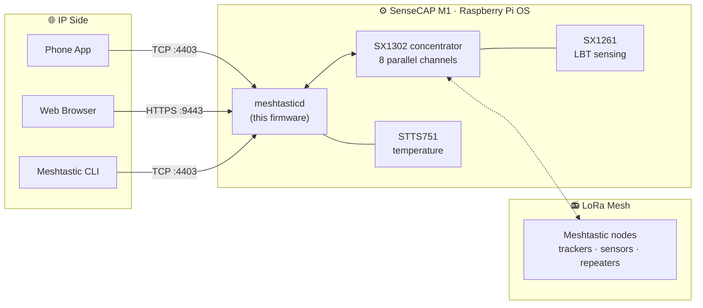

<p align="center">
  
</p>
<h1 align="center">SenseCAP M1 Meshtastic Gateway</h1>
<p align="center"><b>Give your retired Helium miner a second life — as an always-on Meshtastic gateway</b></p>

<p align="center">
  <a href="https://github.com/Seeed-Studio/meshtastic-sx1302/releases">
    
  </a>
  <a href="https://github.com/Seeed-Studio/meshtastic-sx1302/blob/master/LICENSE">
    
  </a>
  <a href="https://github.com/Seeed-Studio/meshtastic-sx1302/commits">
    
  </a>
  
  
</p>

<!-- LANG_SWITCHER_START -->
<p align="center">
  <b>English</b> | <a href="README.zh-CN.md">中文</a> | <a href="README.ja.md">日本語</a> | <a href="README.fr.md">Français</a> | <a href="README.pt.md">Português</a> | <a href="README.es.md">Español</a>
</p>
<!-- LANG_SWITCHER_END -->

**meshtastic-sx1302** is a [Meshtastic](https://meshtastic.org) firmware port for SX1302-based LoRa concentrator hardware. Its flagship target is the Seeed [SenseCAP M1][hw-m1] — a Raspberry Pi CM4 + WM1302 combo originally shipped as a Helium miner — which it turns into a fully featured, always-on Meshtastic mesh gateway with SX1261-based LBT (Listen-Before-Talk) support.



[Meshtastic docs][docs] · [Quick Start](#quick-start) · [Hardware](#hardware-requirements) · [Report Bug][issues]

## Table of Contents

- [Why Give an M1 a Second Life](#why-give-an-m1-a-second-life)
- [Features](#features)
- [Quick Start](#quick-start)
- [Use Cases](#use-cases)
- [Recommended Hardware](#recommended-hardware)
- [Hardware Requirements](#hardware-requirements)
- [Hardware Check](#hardware-check)
- [Installation](#installation)
- [Usage](#usage)
- [Cooling Fan](#cooling-fan)
- [LoRa Region and Compliance](#lora-region-and-compliance)
- [Troubleshooting](#troubleshooting)
- [Known Issues](#known-issues)
- [FAQ](#faq)
- [Contributing](#contributing)

## Why Give an M1 a Second Life

The 2021 Helium boom put a remarkably well-built little computer into thousands of homes. When the mining economics faded, the hardware did not:

| Inside every SenseCAP M1 | |
| --- | --- |
| Compute | Raspberry Pi CM4 (Pi 4 class, 4 GB) |
| Radio | WM1302 module — Semtech SX1302 concentrator (8 channels) + SX1261 |
| Sensing | STTS751 temperature sensor |
| Thermal | Metal case, high-gain antenna, temperature-controlled fan (GPIO 13) |

This repository replaces the mining stack with [Meshtastic](https://meshtastic.org) — the open-source, off-grid LoRa mesh network — and extends the upstream firmware with SX1302 concentrator support and SX1261-based LBT. One reflash later, the box that used to mine a coin now relays messages for a community mesh, 24/7.

## Features

- **Concentrator-grade radio** — drives the SX1302's 8 parallel demodulation channels, so the gateway hears many nodes at once instead of a single channel like handheld radios
- **LBT support (requires SX126x)** — Listen-Before-Talk channel sensing via the SX1261, for compliant transmission in regions that mandate LBT — the core addition of this port
- **Always-on gateway services** — built-in HTTPS Web UI (`:9443`) and TCP API (`:4403`) for browsers, phone apps, and CLI tools
- **One-script install** — `install.sh` deploys the binary, configs, systemd service, and runtime libraries, and enables boot autostart
- **Hardware self-test** — the bundled probe script verifies SX1261 / SX1302 / STTS751 in seconds

## Quick Start

**Prerequisites:** a [SenseCAP M1][hw-m1] (or a Raspberry Pi with a WM1302 module that includes SX126x), one 16 GB+ microSD card, and a computer with a card reader.

```bash
# 1. Flash Raspberry Pi OS Lite 64-bit (Debian 13 trixie) with SSH + WiFi
#    preconfigured — use Raspberry Pi Imager's OS customization settings
#    https://www.raspberrypi.com/documentation/computers/getting-started.html

# 2. Enable SPI/I2C, install the probe's dependencies, then verify the radio
sudo raspi-config nonint do_spi 0 && sudo raspi-config nonint do_i2c 0
sudo apt install python3 python3-spidev python3-smbus
python3 tools/probe_sx130x.py --reset        # expect 3x PASS

# 3. Install and go
tar xzf meshtasticd-sensecap-m1-aarch64*.tar.gz
cd meshtasticd-sensecap-m1-aarch64*/
sudo ./install.sh
```

Three steps. Your miner is now a mesh gateway — open `https://<pi-ip>:9443` in a browser to access the Web UI.

## Use Cases

- **Community mesh backbone** — a fixed, always-on node with a proper antenna stretches a city-scale Meshtastic network far beyond handheld range
- **Emergency preparedness** — an off-grid messaging hub that keeps working when cellular and internet do not
- **Remote monitoring** — collect position and telemetry from trackers and sensors across a farm, campus, or job site
- **Off-grid adventures** — coordinate hiking, overlanding, or sailing groups beyond cell coverage
- **Meshtastic development** — a full Linux box with a concentrator radio is the ideal test bench for protocol and app development

## Recommended Hardware

**The gateway** — if you already own a SenseCAP M1 (any Helium-era unit), you have everything it takes: flash this firmware and it becomes the gateway. No M1? The [WM1302 (SPI) module][hw-wm1302] carries the same SX1302 + SX1261 silicon and connects to a Raspberry Pi over SPI — see the [WM1302 wiki][wiki-wm1302] for wiring, then verify with the same probe script.

**Mesh nodes to pair with it** — a gateway needs nodes to talk to. These Seeed devices run stock Meshtastic firmware out of the box:

| Device | Type | Best for | Link |
| --- | --- | --- | --- |
| SenseCAP Card Tracker T1000-E | Pocket tracker | GPS tracking off the grid, everyday carry | [Buy][hw-sensecap] |
| Wio Tracker L1 Pro | Handheld node | Portable field node with screen for outdoor use | [Buy][hw-wio] |
| XIAO ESP32S3 + Wio-SX1262 | DIY kit | Build your own nodes and sensors at the lowest cost | [Buy][hw-xiao] |

> [!TIP]
> **Pair a gateway with several nodes** — the T1000-E travels with people and vehicles, the Wio L1 Pro serves as a fixed station with a screen, and the XIAO kit keeps DIY node costs to a minimum. All of them talk to your reflashed M1 over the same mesh.

## Hardware Requirements

| Requirement | Details |
| --- | --- |
| Operating system | Raspberry Pi OS Lite 64-bit, **Debian 13 trixie** — [install guide][pi-getting-started] |
| Network | WiFi or Ethernet, configured and reachable from your LAN |
| SPI / I2C | Enabled — [configuration guide][pi-config] |
| Radio module | WM1302 **with SX126x** (LBT-capable variant) |

> [!IMPORTANT]
> The WM1302 variant matters: only modules that include SX126x provide the Listen-Before-Talk sensing this firmware relies on. Run the [hardware check](#hardware-check) below to confirm before installing.

## Hardware Check

```bash
# Dependencies
sudo apt update
sudo apt install python3 python3-spidev python3-smbus gpiod i2c-tools wget git

# Grant your user access to the SPI/I2C/GPIO devices
sudo usermod -aG spi,i2c,gpio $USER

# Log out and back in (or reboot) for the group change to take effect, then:
python3 tools/probe_sx130x.py --reset
```

All three tests must report `PASS`:

```text
SX1261 @ /dev/spidev0.1: PASS
  pram version: SX1261 V2D 2D02
  ...
SX1302 @ /dev/spidev0.0: PASS
  version: 0x10, version string: v1.0
  ...
STTS751 @ /dev/i2c-1 address 0x39: PASS
  product: STTS751-0, temperature: 34.75 °C
  ...
Result: PASS (SX1302 + SX1261 + STTS751 all responded)
```

*`pram version` is not a typo — it labels the SX1261's PRAM (program RAM) version register, read over SPI.*

## Installation

### Option A — Precompiled release (recommended)

Download the latest package from [Releases][releases] and install on the device:

```bash
wget https://github.com/Seeed-Studio/meshtastic-sx1302/releases/latest/download/meshtasticd-sensecap-m1-aarch64.tar.gz
tar xzf meshtasticd-sensecap-m1-aarch64*.tar.gz
cd meshtasticd-sensecap-m1-aarch64*/
sudo ./install.sh
```

Notes:

- The package directory carries a git commit-hash suffix (e.g. `-e3a6d9dcf`) — that is why the `cd` above uses a wildcard.
- `install.sh` copies the binary to `/usr/bin`, installs configs to `/etc/meshtasticd/`, registers the `meshtasticd` systemd service, installs runtime libraries, and enables autostart.
- This repository is currently **private** — release downloads require a signed-in GitHub account with access. If the `wget` returns 404, open the [Releases][releases] page in a browser and grab the latest `.tar.gz` asset manually.

### Option B — Build from source with Docker

```bash
# Aarch64 QEMU emulation (x86 hosts only)
sudo docker run --privileged --rm tonistiigi/binfmt --install arm64

# Build
sudo docker buildx build --platform linux/arm64 -f Dockerfile.sensecap-m1 -t meshtastic-sensecap-m1:arm64 .

# Package
sudo docker run --rm -v "$PWD/release:/out" meshtastic-sensecap-m1:arm64 \
  sh -c 'cp /opt/firmware/.pio/build/sensecap-m1/meshtasticd /out/meshtasticd_linux_aarch64'
WEB_VERSION=2.7.2 bash bin/package-sensecap-m1.sh
```

The packaged `meshtasticd-sensecap-m1-aarch64.tar.gz` lands in the source tree's `release/` directory. `WEB_VERSION` selects which release of the Meshtastic Web UI is bundled into the package — keep it in sync with the firmware you are building. Copy the package to the Pi, extract, and run `install.sh` as in Option A.

## Usage

### Web UI

Browse to `https://<pi-ip>:9443` for the Meshtastic Web UI. On first launch, add a connection inside the page using the same address. The HTTPS certificate is self-signed — accept the browser warning once.

<p align="center">
  
</p>

> [!NOTE]
> Known upstream bug: message ACK status may not display correctly in the Web UI. Pending a fix in Meshtastic upstream.

### Phone App / CLI

Any Meshtastic client works — Android/iOS app, CLI, or Python SDK. Choose a **TCP** connection, enter the Pi's IP, and use the default port **4403**:

```bash
pip install meshtastic
meshtastic --host <pi-ip> --info
```

### Service management

| Action | Command |
| --- | --- |
| Status | `systemctl status meshtasticd` |
| Start / stop / restart | `sudo systemctl start meshtasticd` — substitute `stop` or `restart` |
| Boot autostart | enabled by default — verify with `systemctl is-enabled meshtasticd` |
| Live logs | `journalctl -u meshtasticd -f` |

## Cooling Fan

SenseCAP M1 ships with a temperature-controlled fan wired to **GPIO 13**. Enable it with the official `gpio-fan` overlay — append to `/boot/firmware/config.txt` and reboot:

```bash
dtoverlay=gpio-fan,gpiopin=13,temp=55000,hyst=5000
```

The fan spins up at 55 °C and stops at 50 °C. See the [Raspberry Pi case-fan documentation][pi-case-fan] for details.

## LoRa Region and Compliance

The firmware ships with the **US915** region (902–928 MHz). Change it to match your local regulations and the other nodes on your mesh — via the Web UI radio settings, or the `[Lora]` section of `/etc/meshtasticd/config.yaml`, then restart the service.

| Region | Frequency band |
| --- | --- |
| `US915` (default) | 902–928 MHz |
| `EU_868` | 863–870 MHz |
| `CN_470` | 470–510 MHz |
| `JP923` | 920–928 MHz |

> [!IMPORTANT]
> Every node on a mesh must share the same region and modem preset. Transmitting outside your region's regulations may be unlawful — the SX126x-based LBT in this firmware exists precisely to help meet such rules.

## Troubleshooting

| Symptom | Check |
| --- | --- |
| Green ACT LED never blinks at boot | SD card not seated — power off and reinsert until it clicks |
| Pi is online but unreachable from your PC | Office/public WiFi often isolates clients per access point — reconnect to the same AP, or find the Pi with `arp -a` |
| SSH `Permission denied (publickey,password)` | Expected after a reflash — log in once with the password, then reinstall your key |
| Service fails: `cannot open shared object file` | Missing runtime library — `ldd /usr/bin/meshtasticd` and install the `not found` packages |
| `$'\r': command not found` in a script | Windows CRLF line endings — `sed -i 's/\r$//' FILE` |
| `./install.sh: Permission denied` | Executable bit lost in transit — `chmod +x install.sh` |
| `systemctl` reports unit `meshtastcd` not found | Typo (seen in older docs) — the service is `meshtasticd` |
| Any probe test reports `FAIL` | SPI/I2C enabled? Module seated? Logged out and back in after `usermod`? |

Found a bug? [Open an issue][issues] with the service status, `journalctl -u meshtasticd` output, and probe results.

## Known Issues

- Web UI: message ACK status may not display — tracked upstream in Meshtastic
- Release package directory names include a git commit-hash suffix
- Firmware region defaults to US915 — change it before production use in other regions

## FAQ

**Which WM1302 variants are supported?**
Only modules that include **SX126x** (LBT-capable). Run the [hardware check](#hardware-check) to confirm what your module carries.

**Do I need a SenseCAP M1?**
The M1 is the turnkey path and what the install package targets. Advanced users can adapt the build to other SX1302-based hosts — the probe script is a good starting point.

**The release download returns 404.**
The repository is currently private — download while signed in to an authorized GitHub account, and check the [Releases][releases] page for the exact asset name.

**Can I keep mining Helium with this?**
No — this firmware replaces the mining stack entirely. Consider it a one-way trip toward a more useful network.

## Contributing

We welcome contributions of all kinds!

- **Bug reports and feature requests** — [open an issue][issues]
- **Code contributions** — fork, branch, and submit a PR; keep changes aligned with upstream Meshtastic style where possible
- **Documentation and translations** — improvements and new languages are always appreciated

---

If this project gave your miner a second life, give us a star ⭐ — it helps others discover it!

<!-- Reference-style links -->
[docs]: https://meshtastic.org/docs/
[issues]: https://github.com/Seeed-Studio/meshtastic-sx1302/issues
[releases]: https://github.com/Seeed-Studio/meshtastic-sx1302/releases
[hw-m1]: https://www.seeedstudio.com/SenseCAP-M1-LoRaWAN-Indoor-Gateway-AS923-p-5059.html
[hw-wm1302]: https://www.seeedstudio.com/WM1302-LoRaWAN-Gateway-Module-SPI-US915-p-4890.html
[hw-sensecap]: https://www.seeedstudio.com/SenseCAP-Card-Tracker-T1000-E-for-Meshtastic-p-5913.html
[hw-wio]: https://www.seeedstudio.com/Wio-Tracker-L1-Pro-p-6454.html
[hw-xiao]: https://www.seeedstudio.com/Wio-SX1262-with-XIAO-ESP32S3-p-5982.html
[wiki-wm1302]: https://wiki.seeedstudio.com/WM1302_module/
[pi-getting-started]: https://www.raspberrypi.com/documentation/computers/getting-started.html
[pi-config]: https://www.raspberrypi.com/documentation/computers/configuration.html
[pi-case-fan]: https://www.raspberrypi.com/documentation/computers/configuration.html?#case-fan
