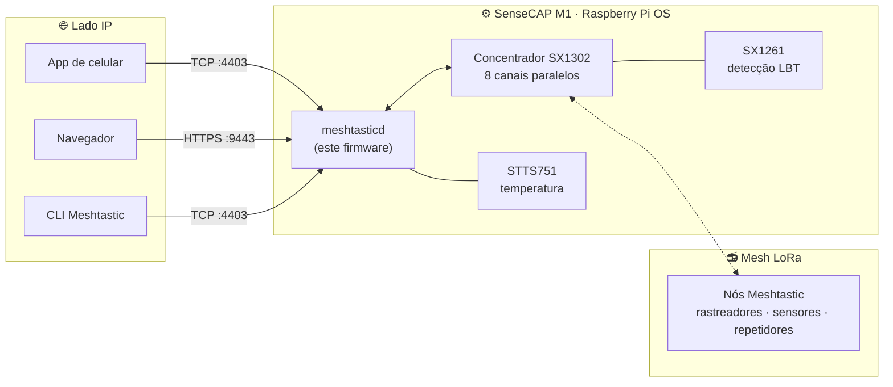

# Gateway Meshtastic SenseCAP M1

<p align="center">
  
</p>

<p align="center">
  <a href="https://github.com/Seeed-Studio/meshtastic-sx1302/releases">
    
  </a>
  <a href="https://github.com/Seeed-Studio/meshtastic-sx1302/blob/master/LICENSE">
    
  </a>
  <a href="https://github.com/Seeed-Studio/meshtastic-sx1302/commits">
    
  </a>
  
  
</p>

<!-- LANG_SWITCHER_START -->
<p align="center">
  <a href="README.md">English</a> | <a href="README.zh-CN.md">中文</a> | <a href="README.ja.md">日本語</a> | <a href="README.fr.md">Français</a> | <b>Português</b> | <a href="README.es.md">Español</a>
</p>
<!-- LANG_SWITCHER_END -->

**meshtastic-sx1302** é um port do firmware [Meshtastic](https://meshtastic.org) para hardware concentrador LoRa SX1302. Seu alvo principal é o [SenseCAP M1][hw-m1] da Seeed — um conjunto Raspberry Pi CM4 + WM1302 originalmente vendido como minerador Helium — que ele transforma em um gateway Meshtastic completo, sempre ativo, com suporte a LBT (Listen-Before-Talk) via SX1261.



[Documentação Meshtastic][docs] · [Início rápido](#início-rápido) · [Hardware](#requisitos-de-hardware) · [Reportar bug][issues]

## Sumário

- [Por que dar uma segunda vida ao seu M1](#por-que-dar-uma-segunda-vida-ao-seu-m1)
- [Funcionalidades](#funcionalidades)
- [Início rápido](#início-rápido)
- [Casos de uso](#casos-de-uso)
- [Hardware recomendado](#hardware-recomendado)
- [Requisitos de hardware](#requisitos-de-hardware)
- [Verificação de hardware](#verificação-de-hardware)
- [Instalação](#instalação)
- [Uso](#uso)
- [Ventoinha de refrigeração](#ventoinha-de-refrigeração)
- [Região LoRa e conformidade](#região-lora-e-conformidade)
- [Solução de problemas](#solução-de-problemas)
- [Problemas conhecidos](#problemas-conhecidos)
- [Perguntas frequentes](#perguntas-frequentes)
- [Contribuindo](#contribuindo)

## Por que dar uma segunda vida ao seu M1

O boom do Helium em 2021 colocou um pequeno computador muito bem construído em milhares de lares. Quando a economia da mineração esfriou, o hardware não envelheceu:

| Dentro de cada SenseCAP M1 | |
| --- | --- |
| Computação | Raspberry Pi CM4 (classe Pi 4, 4 GB) |
| Rádio | Módulo WM1302 — concentrador Semtech SX1302 (8 canais) + SX1261 |
| Sensoriamento | Sensor de temperatura STTS751 |
| Térmico | Carcaça de metal, antena de alto ganho, ventoinha controlada por temperatura (GPIO 13) |

Este repositório substitui a pilha de mineração por [Meshtastic](https://meshtastic.org) — a rede mesh LoRa open source off-grid — e estende o firmware upstream com suporte ao concentrador SX1302 e LBT via SX1261. Um reflash depois, a caixa que minerava uma moeda agora repassa mensagens para uma mesh comunitária, 24/7.

> [!IMPORTANT]
> O módulo WM1302 precisa ser a variante **com SX126x** (capaz de LBT). Módulos sem LBT não conseguem exercer a capacidade central deste firmware. Confirme com a [verificação de hardware](#verificação-de-hardware) antes de instalar.

## Funcionalidades

- **Rádio de classe concentrador** — aciona os 8 canais de demodulação paralelos do SX1302, escutando vários nós ao mesmo tempo, em vez de um único canal como os rádios portáteis
- **Suporte a LBT (requer SX126x)** — detecção de canal Listen-Before-Talk via SX1261, para transmissão em conformidade nas regiões que exigem LBT — a adição central deste port
- **Serviços de gateway permanentes** — Web UI HTTPS integrada (`:9443`) e API TCP (`:4403`) para navegadores, apps de celular e CLI
- **Instalação em um script** — o `install.sh` implanta o binário, as configurações, o serviço systemd e as bibliotecas de runtime, e ativa o autoinício
- **Autoteste de hardware** — o script de sonda incluído verifica SX1261 / SX1302 / STTS751 em segundos

## Início rápido

**Pré-requisitos:** um [SenseCAP M1][hw-m1] (ou um Raspberry Pi com módulo WM1302 contendo SX126x), um cartão microSD de 16 GB ou mais e um computador com leitor de cartão.

```bash
# 1. Grave o Raspberry Pi OS Lite 64 bits (Debian 13 trixie) com SSH + WiFi
#    pré-configurados — use as configurações de personalização do Raspberry Pi Imager
#    https://www.raspberrypi.com/documentation/computers/getting-started.html

# 2. Ative SPI/I2C, instale as dependências da sonda e verifique o rádio
sudo raspi-config nonint do_spi 0 && sudo raspi-config nonint do_i2c 0
sudo apt install python3 python3-spidev python3-smbus
python3 tools/probe_sx130x.py --reset        # espere 3x PASS

# 3. Instale e comece
tar xzf meshtasticd-sensecap-m1-aarch64*.tar.gz
cd meshtasticd-sensecap-m1-aarch64*/
sudo ./install.sh
```

Três passos. Seu minerador virou um gateway mesh — abra `https://<ip-do-pi>:9443` no navegador para acessar a Web UI.

## Casos de uso

- **Estrutura de uma mesh comunitária** — um nó fixo, sempre ativo, com antena decente estende uma rede Meshtastic em escala urbana muito além do alcance de dispositivos portáteis
- **Preparação para emergências** — um hub de mensagens off-grid que segue funcionando quando celular e internet caem
- **Monitoramento remoto** — colete posição e telemetria de rastreadores e sensores em uma fazenda, campus ou obra
- **Aventuras off-grid** — coordene grupos de trilha, overlanding ou vela além da cobertura celular
- **Desenvolvimento Meshtastic** — uma máquina Linux completa com rádio concentrador é o banco de testes ideal para protocolo e apps

## Hardware recomendado

**O gateway** — se você já tem um SenseCAP M1 (qualquer unidade da era Helium), tem tudo o que é preciso: grave este firmware e ele se torna o gateway. Sem um M1? O [módulo WM1302 (SPI)][hw-wm1302] carrega o mesmo silício SX1302 + SX1261 e se conecta a um Raspberry Pi via SPI — veja o [wiki do WM1302][wiki-wm1302] para a fiação, depois valide com o mesmo script de sonda.

**Nós de mesh para combinar** — um gateway precisa de nós com quem conversar. Estes dispositivos Seeed executam o firmware Meshtastic original de fábrica:

| Dispositivo | Tipo | Ideal para | Link |
| --- | --- | --- | --- |
| SenseCAP Card Tracker T1000-E | Rastreador de bolso | GPS off-grid, uso cotidiano no bolso | [Comprar][hw-sensecap] |
| Wio Tracker L1 Pro | Nó portátil | Nó de campo com tela, ideal para exteriores | [Comprar][hw-wio] |
| XIAO ESP32S3 + Wio-SX1262 | Kit DIY | Construir seus próprios nós e sensores ao menor custo | [Comprar][hw-xiao] |

> [!TIP]
> **Um gateway, vários nós** — o T1000-E acompanha pessoas e veículos, o Wio L1 Pro serve como estação fixa com tela, e o kit XIAO mantém o custo dos nós DIY no mínimo. Todos conversam com seu M1 regravado pela mesma mesh.

## Requisitos de hardware

| Requisito | Detalhes |
| --- | --- |
| Sistema operacional | Raspberry Pi OS Lite 64 bits, **Debian 13 trixie** — [guia de instalação][pi-getting-started] |
| Rede | WiFi ou Ethernet, configurada e acessível pela sua LAN |
| SPI / I2C | Ativados — [guia de configuração][pi-config] |
| Módulo de rádio | WM1302 **com SX126x** (variante com LBT) |

> [!IMPORTANT]
> A variante do WM1302 importa: apenas módulos que incluem SX126x fornecem a detecção Listen-Before-Talk da qual este firmware depende. Rode a [verificação de hardware](#verificação-de-hardware) abaixo para confirmar antes de instalar.

## Verificação de hardware

```bash
# Dependências
sudo apt update
sudo apt install python3 python3-spidev python3-smbus gpiod i2c-tools wget git

# Conceda ao seu usuário acesso aos dispositivos SPI/I2C/GPIO
sudo usermod -aG spi,i2c,gpio $USER

# Encerre a sessão e entre novamente (ou reinicie), então:
python3 tools/probe_sx130x.py --reset
```

Os três testes devem reportar `PASS`:

```text
SX1261 @ /dev/spidev0.1: PASS
  pram version: SX1261 V2D 2D02
  ...
SX1302 @ /dev/spidev0.0: PASS
  version: 0x10, version string: v1.0
  ...
STTS751 @ /dev/i2c-1 address 0x39: PASS
  product: STTS751-0, temperature: 34.75 °C
  ...
Result: PASS (SX1302 + SX1261 + STTS751 all responded)
```

*`pram version` não é um erro de digitação — refere-se ao registrador de versão PRAM (RAM de programa) do SX1261, lido via SPI pelo script de sonda.*

## Instalação

### Opção A — Versão pré-compilada (recomendada)

Baixe o pacote mais recente em [Releases][releases] e instale no dispositivo:

```bash
wget https://github.com/Seeed-Studio/meshtastic-sx1302/releases/latest/download/meshtasticd-sensecap-m1-aarch64.tar.gz
tar xzf meshtasticd-sensecap-m1-aarch64*.tar.gz
cd meshtasticd-sensecap-m1-aarch64*/
sudo ./install.sh
```

Observações:

- O nome do diretório do pacote carrega um sufixo de hash git (ex. `-e3a6d9dcf`) — por isso o `cd` acima usa curinga.
- O `install.sh` copia o binário para `/usr/bin`, instala as configurações em `/etc/meshtasticd/`, registra o serviço systemd `meshtasticd`, instala as bibliotecas de runtime e ativa o autoinício.
- Este repositório é atualmente **privado** — o download de releases requer uma conta GitHub conectada e autorizada. Se o `wget` retornar 404, abra a página de [Releases][releases] no navegador e pegue o `.tar.gz` mais recente manualmente.

### Opção B — Compilar a partir do código com Docker

```bash
# Emulação QEMU Aarch64 (apenas hosts x86)
sudo docker run --privileged --rm tonistiigi/binfmt --install arm64

# Build
sudo docker buildx build --platform linux/arm64 -f Dockerfile.sensecap-m1 -t meshtastic-sensecap-m1:arm64 .

# Empacotamento
sudo docker run --rm -v "$PWD/release:/out" meshtastic-sensecap-m1:arm64 \
  sh -c 'cp /opt/firmware/.pio/build/sensecap-m1/meshtasticd /out/meshtasticd_linux_aarch64'
WEB_VERSION=2.7.2 bash bin/package-sensecap-m1.sh
```

O pacote `meshtasticd-sensecap-m1-aarch64.tar.gz` será salvo no diretório `release/` do código-fonte. `WEB_VERSION` define qual versão da Web UI do Meshtastic será incluída no pacote — mantenha-a em sincronia com o firmware que você está compilando. Copie para o Pi, extraia e execute o `install.sh` como na Opção A.

## Uso

### Web UI

Acesse `https://<ip-do-pi>:9443` no navegador para usar a Web UI do Meshtastic. No primeiro acesso, adicione uma conexão dentro da página usando o mesmo endereço. O certificado HTTPS é autoassinado — aceite o aviso do navegador uma vez.

<p align="center">
  
</p>

> [!NOTE]
> Bug conhecido do upstream: o status ACK das mensagens pode não ser exibido corretamente na Web UI. Aguardando correção no Meshtastic upstream.

### App de celular / CLI

Qualquer cliente Meshtastic funciona — app Android/iOS, CLI ou SDK Python. Escolha uma conexão **TCP**, informe o IP do Pi e a porta padrão **4403**:

```bash
pip install meshtastic
meshtastic --host <ip-do-pi> --info
```

### Gerenciamento do serviço

| Ação | Comando |
| --- | --- |
| Status | `systemctl status meshtasticd` |
| Iniciar / parar / reiniciar | `sudo systemctl start meshtasticd` — troque `start` por `stop` ou `restart` |
| Autoinício | ativado por padrão — verifique com `systemctl is-enabled meshtasticd` |
| Logs em tempo real | `journalctl -u meshtasticd -f` |

## Ventoinha de refrigeração

O SenseCAP M1 vem com uma ventoinha controlada por temperatura ligada ao **GPIO 13**. Ative-a com o overlay oficial `gpio-fan` — adicione ao `/boot/firmware/config.txt` e reinicie:

```bash
dtoverlay=gpio-fan,gpiopin=13,temp=55000,hyst=5000
```

A ventoinha liga a 55 °C e desliga a 50 °C. Veja a [documentação case-fan do Raspberry Pi][pi-case-fan] para detalhes.

## Região LoRa e conformidade

O firmware vem com a região **US915** (902–928 MHz). Altere-a para corresponder às suas regulamentações locais e aos demais nós da mesh — via configurações de rádio da Web UI, ou na seção `[Lora]` de `/etc/meshtasticd/config.yaml`, e reinicie o serviço.

| Região | Faixa de frequência |
| --- | --- |
| `US915` (padrão) | 902–928 MHz |
| `EU_868` | 863–870 MHz |
| `CN_470` | 470–510 MHz |
| `JP923` | 920–928 MHz |

> [!IMPORTANT]
> Todos os nós de uma mesh devem compartilhar a mesma região e o mesmo preset de modem. Transmitir fora das regulamentações da sua região pode ser ilegal — o LBT via SX126x deste firmware existe justamente para ajudar a cumprir tais regras.

## Solução de problemas

| Sintoma | Verificação |
| --- | --- |
| LED ACT verde nunca pisca na inicialização | Cartão SD mal encaixado — desligue e reinsira até travar |
| Pi está online mas inacessível do seu PC | WiFi de escritório/público costuma isolar clientes por ponto de acesso — reconecte ao mesmo AP, ou localize o Pi com `arp -a` |
| SSH `Permission denied (publickey,password)` | Esperado após um reflash — entre uma vez com a senha e reinstale sua chave |
| Serviço falha: `cannot open shared object file` | Biblioteca de runtime faltando — `ldd /usr/bin/meshtasticd` e instale os pacotes `not found` |
| `$'\r': command not found` em um script | Fim de linha CRLF do Windows — `sed -i 's/\r$//' ARQUIVO` |
| `./install.sh: Permission denied` | Bit de execução perdido no caminho — `chmod +x install.sh` |
| `systemctl` não encontra a unidade `meshtastcd` | Erro de grafia (visto em docs antigas) — o serviço é `meshtasticd` |
| Algum teste de sonda dá `FAIL` | SPI/I2C ativados? Módulo bem encaixado? Reconectou após o `usermod`? |

Encontrou um bug? [Abra uma issue][issues] com o status do serviço, a saída de `journalctl -u meshtasticd` e os resultados da sonda.

## Problemas conhecidos

- Web UI: o status ACK das mensagens pode não ser exibido — rastreado no upstream do Meshtastic
- Os nomes de diretório dos pacotes incluem um sufixo de hash git
- A região padrão do firmware é US915 — altere antes do uso em produção em outras regiões

## Perguntas frequentes

**Quais variantes do WM1302 são suportadas?**
Apenas módulos que incluem **SX126x** (com LBT). Rode a [verificação de hardware](#verificação-de-hardware) para confirmar.

**Preciso de um SenseCAP M1?**
O M1 é o caminho pronto e o alvo do pacote de instalação. Usuários avançados podem adaptar o build para outros hosts SX1302 — o script de sonda é um bom ponto de partida.

**O download da release retorna 404.**
O repositório é atualmente privado — baixe logado em uma conta GitHub autorizada e confira na página de [Releases][releases] o nome exato do asset.

**Posso continuar minerando Helium com isto?**
Não — este firmware substitui completamente a pilha de mineração. Considere-o uma passagem só de ida para uma rede mais útil.

## Contribuindo

Recebemos contribuições de todos os tipos!

- **Relatórios de bugs e pedidos de recursos** — [abra uma issue][issues]
- **Contribuições de código** — faça fork, crie um branch e envie um PR; mantenha o alinhamento com o estilo do Meshtastic upstream quando possível
- **Documentação e traduções** — melhorias e novos idiomas são sempre bem-vindos

---

Se este projeto deu uma segunda vida ao seu minerador, deixe uma estrela ⭐ — isso ajuda outras pessoas a descobri-lo!

<!-- Links de referência -->
[docs]: https://meshtastic.org/docs/
[issues]: https://github.com/Seeed-Studio/meshtastic-sx1302/issues
[releases]: https://github.com/Seeed-Studio/meshtastic-sx1302/releases
[hw-m1]: https://www.seeedstudio.com/SenseCAP-M1-LoRaWAN-Indoor-Gateway-AS923-p-5059.html
[hw-wm1302]: https://www.seeedstudio.com/WM1302-LoRaWAN-Gateway-Module-SPI-US915-p-4890.html
[hw-sensecap]: https://www.seeedstudio.com/SenseCAP-Card-Tracker-T1000-E-for-Meshtastic-p-5913.html
[hw-wio]: https://www.seeedstudio.com/Wio-Tracker-L1-Pro-p-6454.html
[hw-xiao]: https://www.seeedstudio.com/Wio-SX1262-with-XIAO-ESP32S3-p-5982.html
[wiki-wm1302]: https://wiki.seeedstudio.com/WM1302_module/
[pi-getting-started]: https://www.raspberrypi.com/documentation/computers/getting-started.html
[pi-config]: https://www.raspberrypi.com/documentation/computers/configuration.html
[pi-case-fan]: https://www.raspberrypi.com/documentation/computers/configuration.html?#case-fan
