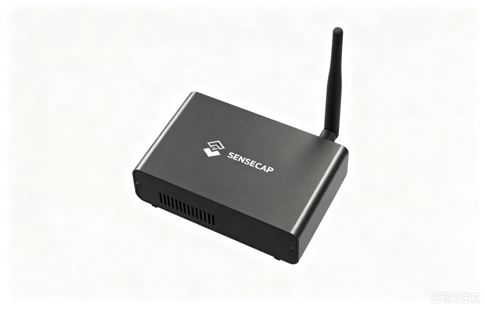
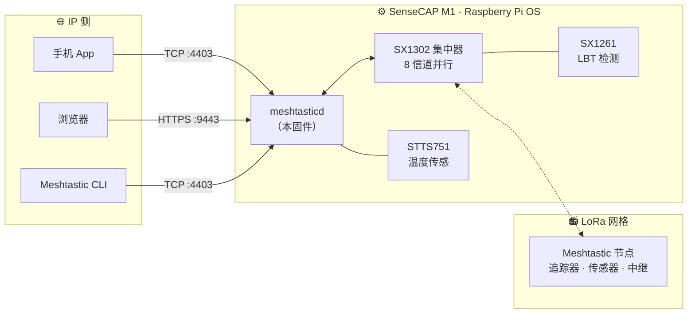
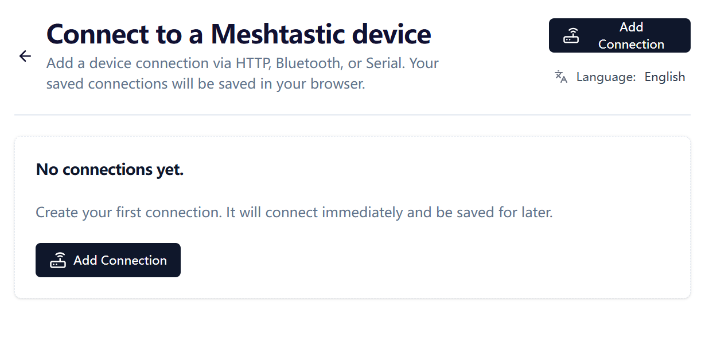

# SenseCAP M1 Meshtastic 网关

<p align="center">
  
</p>

<p align="center">
  <a href="https://github.com/Seeed-Studio/meshtastic-sx1302/releases">
    
  </a>
  <a href="https://github.com/Seeed-Studio/meshtastic-sx1302/blob/master/LICENSE">
    
  </a>
  <a href="https://github.com/Seeed-Studio/meshtastic-sx1302/commits">
    
  </a>
  
  
</p>

<!-- LANG_SWITCHER_START -->
<p align="center">
  <a href="README.md">English</a> | <b>中文</b> | <a href="README.ja.md">日本語</a> | <a href="README.fr.md">Français</a> | <a href="README.pt.md">Português</a> | <a href="README.es.md">Español</a>
</p>
<!-- LANG_SWITCHER_END -->

**meshtastic-sx1302** 是面向 SX1302 LoRa 集中器硬件的 [Meshtastic](https://meshtastic.org) 固件移植。首要目标设备是 Seeed [SenseCAP M1][hw-m1]——一台以 Helium 矿机身份出厂的"树莓派 CM4 + WM1302"组合——本固件将其改造为功能完整、全天候在线的 Meshtastic 网格网关，并支持基于 SX1261 的 LBT（先听后说）。



[Meshtastic 文档][docs] · [快速开始](#快速开始) · [硬件要求](#硬件要求) · [提交 Bug][issues]

## 目录

- [为什么让 M1 重获新生](#为什么让-m1-重获新生)
- [功能特性](#功能特性)
- [快速开始](#快速开始)
- [使用场景](#使用场景)
- [推荐硬件](#推荐硬件)
- [硬件要求](#硬件要求)
- [硬件自检](#硬件自检)
- [安装](#安装)
- [使用](#使用)
- [散热风扇](#散热风扇)
- [LoRa 区域与合规](#lora-区域与合规)
- [故障排查](#故障排查)
- [已知问题](#已知问题)
- [常见问题](#常见问题)
- [参与贡献](#参与贡献)

## 为什么让 M1 重获新生

2021 年的 Helium 热潮把成千上万台做工精良的小电脑送进了千家万户。挖矿收益退潮之后，硬件并没有贬值：

| 每台 SenseCAP M1 的内部配置 | |
| --- | --- |
| 计算 | 树莓派 CM4（Pi 4 级，4 GB） |
| 无线 | WM1302 模组——Semtech SX1302 集中器（8 信道）+ SX1261 |
| 传感 | STTS751 温度传感器 |
| 散热 | 金属外壳、高增益天线、温控风扇（GPIO 13） |

本仓库用 [Meshtastic](https://meshtastic.org)——开源的离网 LoRa 网格网络——替换整套挖矿软件栈，并在上游固件基础上扩展了 SX1302 集中器支持与基于 SX1261 的 LBT。一次重刷之后，这台曾经挖币的盒子开始为社区网格 7×24 小时接力消息。

> [!IMPORTANT]
> 网关模组必须是**包含 SX126x 的 WM1302 版本**（即支持 LBT 的版本）。不支持 LBT 的模组无法发挥本固件的核心能力，安装前请先运行[硬件自检](#硬件自检)确认。

## 功能特性

- **集中器级无线性能** —— 驱动 SX1302 的 8 路并行解调信道，同时聆听多个节点，而非手持电台那样的单信道
- **LBT 支持（需 SX126x）** —— 通过 SX1261 进行先听后说的信道检测，满足要求 LBT 的地区的合规发射要求，这是本移植的核心增强
- **常驻网关服务** —— 内置 HTTPS Web UI（`:9443`）与 TCP API（`:4403`），服务浏览器、手机 App 与 CLI
- **一键脚本安装** —— `install.sh` 部署二进制、配置、systemd 服务与运行库，并开启自启动
- **硬件自检** —— 附带的探测脚本数秒内验证 SX1261 / SX1302 / STTS751

## 快速开始

**前置条件：** 一台 [SenseCAP M1][hw-m1]（或配了含 SX126x 的 WM1302 模组的树莓派）、一张 16 GB 以上 microSD 卡、一台带读卡器的电脑。

```bash
# 1. 用 Raspberry Pi Imager 烧录 Raspberry Pi OS Lite 64 位（Debian 13 trixie），
#    并在烧录设置中预配置 SSH 与 WiFi
#    https://www.raspberrypi.com/documentation/computers/getting-started.html

# 2. 启用 SPI/I2C，安装探测脚本依赖，然后验证无线硬件
sudo raspi-config nonint do_spi 0 && sudo raspi-config nonint do_i2c 0
sudo apt install python3 python3-spidev python3-smbus
python3 tools/probe_sx130x.py --reset        # 期望 3 项 PASS

# 3. 安装并启动
tar xzf meshtasticd-sensecap-m1-aarch64*.tar.gz
cd meshtasticd-sensecap-m1-aarch64*/
sudo ./install.sh
```

三步走完，矿机变网关——浏览器打开 `https://<树莓派IP>:9443` 即可进入 Web UI。

## 使用场景

- **社区网格骨干** —— 固定位置、常年在线、天线优良，把城市尺度的 Meshtastic 网络延伸到手持设备够不着的地方
- **应急备灾** —— 蜂窝与互联网瘫痪时依然可用的离网消息枢纽
- **远程监测** —— 汇集农场、园区、工地上的追踪器与传感器位置和遥测数据
- **户外无网活动** —— 徒步、越野、航海编队在信号覆盖之外保持联络
- **Meshtastic 开发** —— 一台带集中器无线电的完整 Linux 主机，是协议与应用开发的理想试验台

## 推荐硬件

**网关本体** —— 如果你已有一台 SenseCAP M1（任意 Helium 时代的矿机），那你已经万事俱备：刷入本固件它就是网关。没有 M1？[WM1302（SPI）模组][hw-wm1302] 搭载同款 SX1302 + SX1261 芯片，通过 SPI 连接树莓派——接线参考 [WM1302 Wiki][wiki-wm1302]，再用同一个探测脚本验证。

**配套 mesh 节点** —— 网关需要节点来对话。以下 Seeed 设备出厂即运行原版 Meshtastic 固件：

| 设备 | 类型 | 最适合 | 链接 |
| --- | --- | --- | --- |
| SenseCAP Card Tracker T1000-E | 口袋追踪器 | 离网 GPS 定位、日常随身携带 | [购买][hw-sensecap] |
| Wio Tracker L1 Pro | 手持节点 | 带屏幕的便携现场节点，适合户外 | [购买][hw-wio] |
| XIAO ESP32S3 + Wio-SX1262 | DIY 套件 | 最低成本自制节点与传感器 | [购买][hw-xiao] |

> [!TIP]
> **一个网关搭配多个节点** —— T1000-E 跟随人和车辆，Wio L1 Pro 作为带屏固定站，XIAO 套件把自制节点成本压到最低。它们都通过同一个网格与你刷好的 M1 对话。

## 硬件要求

| 要求 | 说明 |
| --- | --- |
| 操作系统 | Raspberry Pi OS Lite 64 位，**Debian 13 trixie** —— [安装指南][pi-getting-started] |
| 网络 | WiFi 或以太网，已配置且局域网内可达 |
| SPI / I2C | 已启用 —— [配置指南][pi-config] |
| 无线模组 | **含 SX126x 的 WM1302**（支持 LBT 的版本） |

> [!IMPORTANT]
> WM1302 的版本很重要：只有包含 SX126x 的模组才具备本固件依赖的先听后说检测能力。安装前请先运行[硬件自检](#硬件自检)确认。

## 硬件自检

```bash
# 安装依赖
sudo apt update
sudo apt install python3 python3-spidev python3-smbus gpiod i2c-tools wget git

# 授予用户访问 SPI/I2C/GPIO 设备的权限
sudo usermod -aG spi,i2c,gpio $USER

# 注销重新登录（或重启）使组变更生效，然后运行：
python3 tools/probe_sx130x.py --reset
```

三项测试全部显示 `PASS` 即为就绪：

```text
SX1261 @ /dev/spidev0.1: PASS
  pram version: SX1261 V2D 2D02
  ...
SX1302 @ /dev/spidev0.0: PASS
  version: 0x10, version string: v1.0
  ...
STTS751 @ /dev/i2c-1 address 0x39: PASS
  product: STTS751-0, temperature: 34.75 °C
  ...
Result: PASS (SX1302 + SX1261 + STTS751 all responded)
```

*`pram version` 并非拼写错误——它指 SX1261 的 PRAM（程序 RAM）版本寄存器，由探测脚本通过 SPI 读取。*

## 安装

### 方式 A —— 预编译版本（推荐）

从 [Releases][releases] 下载最新安装包，在设备上直接安装：

```bash
wget https://github.com/Seeed-Studio/meshtastic-sx1302/releases/latest/download/meshtasticd-sensecap-m1-aarch64.tar.gz
tar xzf meshtasticd-sensecap-m1-aarch64*.tar.gz
cd meshtasticd-sensecap-m1-aarch64*/
sudo ./install.sh
```

注意事项：

- 解压目录名带有 git 提交哈希后缀（如 `-e3a6d9dcf`），所以 `cd` 使用了通配符。
- `install.sh` 会将二进制复制到 `/usr/bin`、配置安装到 `/etc/meshtasticd/`、注册 `meshtasticd` systemd 服务、安装运行库并开启自启动。
- 本仓库目前为**私有仓库**——下载 Release 需登录有权限的 GitHub 账号。若 `wget` 返回 404，请在浏览器打开 [Releases][releases] 页面手动下载最新的 `.tar.gz`。

### 方式 B —— Docker 源码编译

```bash
# Aarch64 QEMU 模拟（仅 x86 主机需要）
sudo docker run --privileged --rm tonistiigi/binfmt --install arm64

# 编译
sudo docker buildx build --platform linux/arm64 -f Dockerfile.sensecap-m1 -t meshtastic-sensecap-m1:arm64 .

# 打包
sudo docker run --rm -v "$PWD/release:/out" meshtastic-sensecap-m1:arm64 \
  sh -c 'cp /opt/firmware/.pio/build/sensecap-m1/meshtasticd /out/meshtasticd_linux_aarch64'
WEB_VERSION=2.7.2 bash bin/package-sensecap-m1.sh
```

打包好的 `meshtasticd-sensecap-m1-aarch64.tar.gz` 会保存在源码的 `release/` 目录。`WEB_VERSION` 指定打包时内置的 Meshtastic Web UI 版本——请与所编译的固件版本保持一致。复制到树莓派后解压并执行 `install.sh`（同方式 A）。

## 使用

### Web UI

浏览器访问 `https://<树莓派IP>:9443` 即可使用 Meshtastic Web UI。首次运行需要在页面内添加连接，连接地址填写同一个 URL。HTTPS 证书为自签名——接受一次浏览器警告即可。

<p align="center">
  
</p>

> [!NOTE]
> 已知上游 Bug：Web UI 中消息的 ACK 状态可能无法正常显示，待 Meshtastic 上游修复。

### 手机 App / CLI

兼容所有 Meshtastic 客户端——Android/iOS App、CLI 或 Python SDK。连接方式选择 **TCP**，输入树莓派 IP，端口默认 **4403**：

```bash
pip install meshtastic
meshtastic --host <树莓派IP> --info
```

### 服务管理

| 操作 | 命令 |
| --- | --- |
| 查看状态 | `systemctl status meshtasticd` |
| 启动 / 停止 / 重启 | `sudo systemctl start meshtasticd`——把 `start` 换成 `stop` 或 `restart` 即可 |
| 开机自启 | 默认已开启——用 `systemctl is-enabled meshtasticd` 验证 |
| 实时日志 | `journalctl -u meshtasticd -f` |

## 散热风扇

SenseCAP M1 出厂配有温控风扇，控制引脚为 **GPIO 13**。使用官方 `gpio-fan` overlay 启用——在 `/boot/firmware/config.txt` 末尾追加并重启：

```bash
dtoverlay=gpio-fan,gpiopin=13,temp=55000,hyst=5000
```

风扇 55 °C 启动、50 °C 停止。详见[树莓派官方 case-fan 文档][pi-case-fan]。

## LoRa 区域与合规

固件默认区域为 **US915**（902–928 MHz）。请根据当地法规与网格内其他节点修改——通过 Web UI 的无线设置，或 `/etc/meshtasticd/config.yaml` 的 `[Lora]` 段，改完重启服务。

| 区域 | 频段 |
| --- | --- |
| `US915`（默认） | 902–928 MHz |
| `EU_868` | 863–870 MHz |
| `CN_470` | 470–510 MHz |
| `JP923` | 920–928 MHz |

> [!IMPORTANT]
> 同一网格内所有节点的区域与调制预设必须一致。在所在区域法规之外发射可能违法——本固件的 SX126x LBT 能力正是为满足此类规则而存在。

## 故障排查

| 症状 | 检查 |
| --- | --- |
| 开机绿灯始终不闪 | SD 卡未插到位——断电后重插，听到"咔哒"声 |
| Pi 在线但电脑连不上 | 办公/公共 WiFi 常按 AP 隔离客户端——重连到同一 AP，或用 `arp -a` 定位 Pi |
| SSH 报 `Permission denied (publickey,password)` | 重刷系统后的预期现象——先用密码登录一次，再重装公钥 |
| 服务启动失败：`cannot open shared object file` | 缺运行库——`ldd /usr/bin/meshtasticd`，安装标记 `not found` 的包 |
| 脚本报 `$'\r': command not found` | Windows CRLF 换行符——`sed -i 's/\r$//' 文件名` |
| `./install.sh: Permission denied` | 传输中丢失可执行位——`chmod +x install.sh` |
| `systemctl` 找不到单元 `meshtastcd` | 拼写错误（旧文档常见）——服务名是 `meshtasticd` |
| 探测任一项 `FAIL` | SPI/I2C 启用了吗？模组插紧了吗？`usermod` 后重新登录了吗？ |

发现 Bug？请[提交 issue][issues]，附上服务状态、`journalctl -u meshtasticd` 输出与探测结果。

## 已知问题

- Web UI：消息 ACK 状态可能显示异常——Meshtastic 上游问题
- Release 包目录名包含 git 提交哈希后缀
- 固件默认区域为 US915——在其他区域投入正式使用前请修改

## 常见问题

**支持哪些 WM1302 版本？**
仅限**包含 SX126x**（支持 LBT）的模组。运行[硬件自检](#硬件自检)即可确认。

**必须要 SenseCAP M1 吗？**
M1 是开箱即用的路径，安装包也以它为目标。进阶用户可以把构建适配到其他 SX1302 主机——探测脚本是很好的起点。

**Release 下载 404？**
仓库目前为私有——请登录有权限的 GitHub 账号下载，并到 [Releases][releases] 页面确认附件的确切文件名。

**装了还能继续挖 Helium 吗？**
不能——本固件完整替换了挖矿软件栈。把它当作通往一张更有用的网络的单程票。

## 参与贡献

欢迎各种形式的贡献！

- **Bug 反馈与功能请求** —— [提交 issue][issues]
- **代码贡献** —— fork 后开分支提交 PR，风格尽量与 Meshtastic 上游保持一致
- **文档与翻译** —— 欢迎改进文档、补充新语言

---

如果这个项目让你的矿机重获新生，欢迎点个 Star ⭐ ——帮助更多人发现它！

<!-- 链接定义 -->
[docs]: https://meshtastic.org/docs/
[issues]: https://github.com/Seeed-Studio/meshtastic-sx1302/issues
[releases]: https://github.com/Seeed-Studio/meshtastic-sx1302/releases
[hw-m1]: https://www.seeedstudio.com/SenseCAP-M1-LoRaWAN-Indoor-Gateway-AS923-p-5059.html
[hw-wm1302]: https://www.seeedstudio.com/WM1302-LoRaWAN-Gateway-Module-SPI-US915-p-4890.html
[hw-sensecap]: https://www.seeedstudio.com/SenseCAP-Card-Tracker-T1000-E-for-Meshtastic-p-5913.html
[hw-wio]: https://www.seeedstudio.com/Wio-Tracker-L1-Pro-p-6454.html
[hw-xiao]: https://www.seeedstudio.com/Wio-SX1262-with-XIAO-ESP32S3-p-5982.html
[wiki-wm1302]: https://wiki.seeedstudio.com/WM1302_module/
[pi-getting-started]: https://www.raspberrypi.com/documentation/computers/getting-started.html
[pi-config]: https://www.raspberrypi.com/documentation/computers/configuration.html
[pi-case-fan]: https://www.raspberrypi.com/documentation/computers/configuration.html?#case-fan
